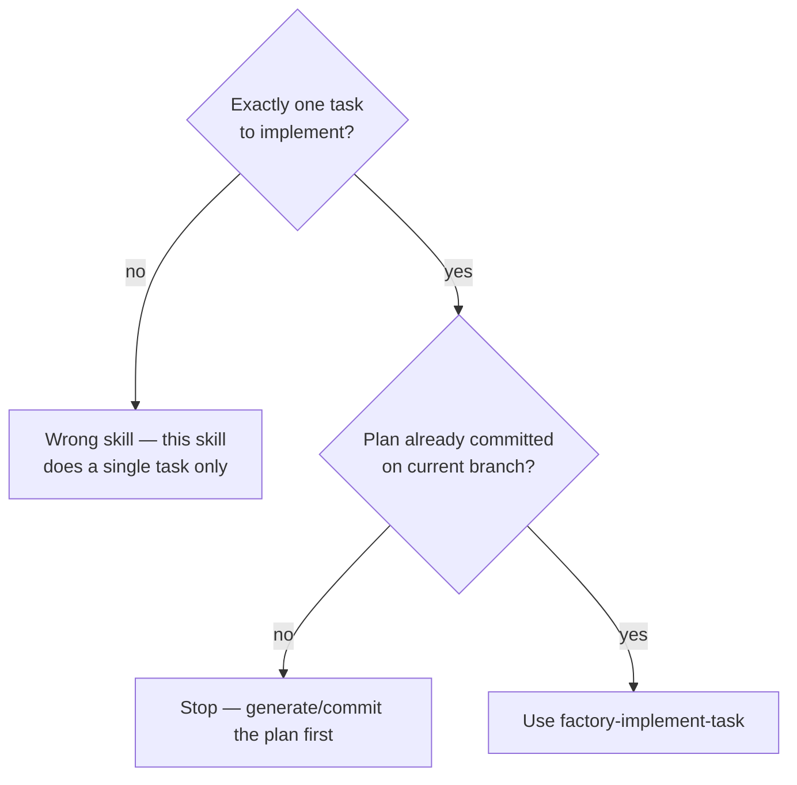
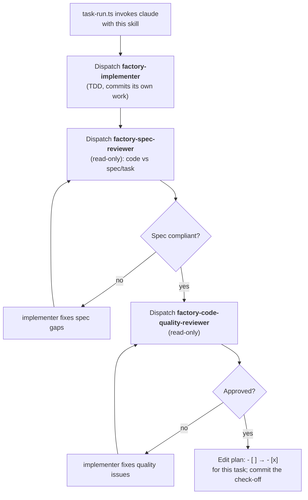

# Factory Implement Task

Implement exactly ONE task from a plan already committed to the current branch.
Dispatch a fresh implementer subagent, then review in two stages: spec compliance
first, then code quality. **Do not loop over other tasks** — the surrounding
`task-run.ts` pipeline owns iteration across tasks.

## When to Use

## The Process

## Rules

- Dispatch the implementer with the full task text (it does not read the plan file).
- Spec review happens BEFORE code-quality review. Never reorder.
- A reviewer that finds issues → implementer fixes → re-review. Repeat until approved.
- Both reviewers are read-only; only the implementer changes files.
- The agents enforce factory mode (single task, current branch, no worktree, no
  branch creation, no push, no PR) through their own tool allowlists — you do not
  need to restate those rules to them.
- When both reviews pass and tests are green, flip this task's `- [ ]` to `- [x]`
  in the plan's `## Task Checklist` and commit with
  `factory: complete task <N> — <task title>`.

## Red Flags

- Starting code-quality review before spec compliance is ✅
- Proceeding to the check-off with an open review issue
- Looping to another task (out of scope for this skill)
