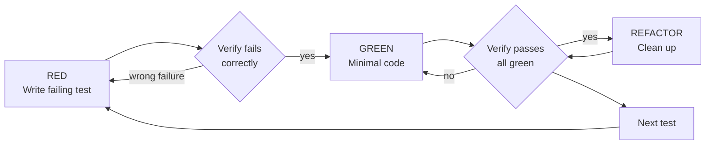

# Factory TDD

## Overview

Write the test first. Watch it fail. Write minimal code to pass.

**Core principle:** If you didn't watch the test fail, you don't know if it tests the right thing.

This repo runs Bun. Use `bun test <path>` to run tests and `import { test, expect, describe } from "bun:test"`.

## The Iron Law

```
NO PRODUCTION CODE WITHOUT A FAILING TEST FIRST
```

Wrote code before the test? Delete it. Implement fresh from the test.

## Red-Green-Refactor



### RED — write one minimal failing test

One behavior, clear name, real code (no mocks unless unavoidable).

### Verify RED — watch it fail

Run `bun test <path>`. Confirm it fails because the feature is missing, not because of a typo. A test that passes immediately tests existing behavior — fix it.

### GREEN — minimal code

Write the simplest code that passes. No extra features (YAGNI).

### Verify GREEN — watch it pass

Run `bun test <path>`. Confirm this test and all others pass with pristine output.

### REFACTOR

Remove duplication, improve names, extract helpers — keeping tests green. Don't add behavior.

## Factory-mode constraints

- Separate pure logic from I/O; unit-test the pure logic.
- You implement exactly ONE task. Do not loop to other tasks.
- Commit your own work with a clear message when green.
- Run one command per Bash call (no `&&`/pipes), and use the native Read/Grep/Glob
  tools instead of shell `cat`/`grep`/`find` — chained or out-of-surface commands are
  rejected headlessly and waste turns.

## When stuck

| Problem                   | What it signals                                         |
| ------------------------- | ------------------------------------------------------- |
| Don't know how to test it | Write the wished-for API first, then the assertion.     |
| Test is too complicated   | The design is too complicated — simplify the interface. |
| You must mock everything  | The code is too coupled — use dependency injection.     |
| Test setup is huge        | Extract helpers; if still complex, simplify the design. |

## Testing anti-patterns

- Don't assert on mock behavior (e.g. call counts on a mock) in place of real output.
- Don't add test-only methods or hooks to production code.
- Don't mock a dependency you don't understand — understand it first.

## Red Flags — stop and start over

- Code before test
- Test passes immediately
- Can't explain why the test failed
- "I'll add tests later" / "already manually tested"
