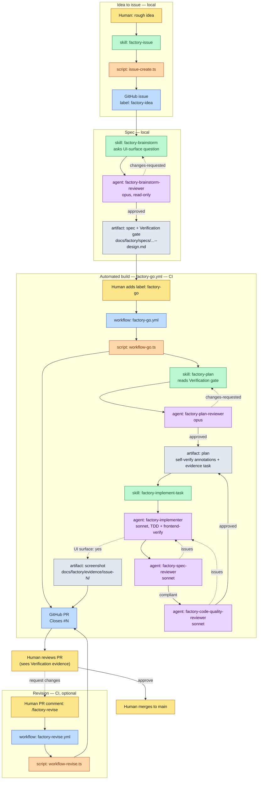
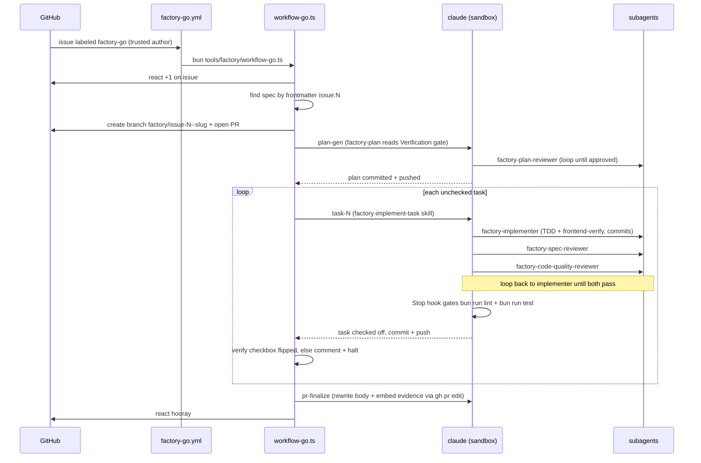

# The AI Factory — Process Guide

The **AI factory** turns a rough idea into a reviewed pull request through a chain
of small, single-purpose stages. The early stages are **human-driven and local** —
you run them inside a Claude Code session, one question at a time, until a reviewed
artifact is committed to `main`. A single label then flips the work into a
**fully automated CI build** that plans, implements, self-reviews, and opens a PR.
A PR comment can ask the automation for another revision round; a human approves
and merges.

The pipeline is built from four kinds of part:

- **GitHub (the control plane)** — issues, labels, and PR comments are the signals
  that move work between stages. A label or a comment substring is all it takes to
  hand off to the automation.
- **GitHub Actions workflows** — two YAML workflows (`factory-go`, `factory-revise`)
  watch for those signals and launch the CI orchestrators.
- **Skills** — `factory-*` skills (plus `frontend-verify`) encode the _how_ of each
  stage (interview, write a spec, decompose a plan, implement one task, browser-verify
  a UI). They run in a Claude session, whether you invoke them locally or CI invokes
  them headlessly.
- **Subagents** — one TDD implementer plus several read-only reviewers, dispatched
  by the implement-task skill during the build.

The connective tissue is a set of `tools/factory/*.ts` Bun/TypeScript scripts: two
orchestrators (`workflow-go.ts`, `workflow-revise.ts`) plus helpers that create
issues, author specs, parse plans, and drive the `claude` and `gh` CLIs. During CI,
every `claude` invocation runs inside an **OS sandbox** (see
[The runner environment](#the-runner-environment)).

A signal threaded through the whole pipeline is the spec's **`## Verification`
gate** — `UI surface: yes | no`, declared once during brainstorm and inherited
downstream without re-deciding. On `yes`, the implementer browser-verifies frontend
work and one screenshot is committed and embedded in the PR; on `no`, none of that
fires (factory/infra and backend-only work). See
[The verification gate](#the-verification-gate).

> The diagrams below are Mermaid. This guide cannot render them — please preview the
> rendered output and report any diagram that fails to parse so it can be fixed.

---

## The big picture



**Legend:** 🟨 human action · 🟦 GitHub object · 🟩 skill · 🟪 subagent · 🟧 script · ⬜ artifact.

---

## The verification gate

The UI-surface signal is declared **once in the spec** and flows unchanged through
the pipeline — no component re-decides; each inherits and acts. The spec ends with:

```
## Verification
UI surface: yes | no
# only when yes:
Outcome: <the user-visible result that, observed in a browser, proves the feature
          works — described abstractly, not as routes or click steps>
```

It stays **abstract on purpose**: _what_ outcome proves the feature, never the
concrete routes/selectors/click steps (those are the plan's and implementer's job,
and routes may not exist at spec time). `UI surface: no` is the default for
factory/infra and backend-only work.

| Component                     | Role at the gate                                                                                                                                            |
| ----------------------------- | ----------------------------------------------------------------------------------------------------------------------------------------------------------- |
| `factory-brainstorm`          | **Raises** it: asks the UI-surface question, captures the abstract `Outcome` on `yes`, writes the `## Verification` section.                                |
| `factory-brainstorm-reviewer` | Confirms the section is present and well-formed (abstract `Outcome` on `yes`, not over-specified).                                                          |
| `factory-plan`                | **Enforces** it: on `yes` → annotate frontend impl tasks "self-verify in browser (frontend-verify)" + emit one evidence task at the end. On `no` → neither. |
| `factory-plan-reviewer`       | Verifies the gate was applied correctly (annotations present, exactly one evidence task, or neither on `no`).                                               |
| `factory-implementer`         | **Self-verifies** annotated tasks via the `frontend-verify` skill (Chromium, mandatory teardown); runs the evidence task.                                   |
| `pr-finalize`                 | **Embeds** any screenshot under `docs/factory/evidence/issue-<N>/` inline in the PR body under `## Verification evidence`.                                  |

Enforcement is via **skill instructions to the model**, not a new deterministic
parser: `lib/plan.ts` still parses only the `## Task Checklist`; the evidence task is
an ordinary checkbox line, framed as non-TDD "evidence capture" so neither the
reviewers nor the implementer's TDD self-review flag it.

---

## Stage-by-stage walkthrough

### 1. Idea → issue _(local, human-driven)_

Invoke the **`factory-issue`** skill. It runs a mini-interview (feature or bug, then
a few one-at-a-time questions) and files the issue via **`tools/factory/issue-create.ts`**.
All issues get the **`factory-idea`** label; bugs also get **`bug`**. Never run
`gh issue create` directly — it bypasses the format and labels the pipeline depends on.

**Produces:** a GitHub issue. **Hands off:** the issue number.

### 2. Issue → spec _(local, human-driven)_

Invoke the **`factory-brainstorm`** skill. It reads the issue (via `spec-author.ts`),
runs a one-question-at-a-time dialogue, proposes 2–3 approaches, presents the design
section-by-section, and — as part of the dialogue — **asks the UI-surface question**
to raise the verification gate. It then loops the **`factory-brainstorm-reviewer`**
subagent (opus, read-only) until it returns **`approved`**. After a human gate it
commits the spec to `main` with `spec-author.ts --commit-spec`.

**Produces:** `docs/factory/specs/<YYYY-MM-DD-HHMM>--issue-<N>--<slug>--design.md`,
frontmatter `{name, description, status: draft, issue: N}`, ending with the
`## Verification` section.
**Invariant:** the `issue:` frontmatter is validated on every write by the
`factory-spec-frontmatter` hook; the reviewer confirms the `## Verification` section
is present and abstract. **Hands off:** prints
`gh issue edit N --add-label factory-go`.

### 3. The label gate _(human-driven)_

A human adds the **`factory-go`** label to the issue. This is the single switch from
local/human work to automated/CI work. The workflow only runs if the **issue author**
is an `OWNER`, `MEMBER`, or `COLLABORATOR` — the prompt-injection surface is kept to
trusted authors because the CI build runs with loosened in-run permissions.

### 4. Plan generation _(CI, automated)_

`factory-go.yml` → `workflow-go.ts` reacts 👍, finds the spec by matching frontmatter
`issue:`, creates branch `factory/issue-<N>--<slug>`, opens a PR (`Closes #N`), then
invokes the **`factory-plan`** skill (headless `claude`). The skill decomposes the
spec, **reads the `## Verification` gate** (on `yes`: annotates frontend tasks with a
self-verify expectation and appends one evidence task), and loops the
**`factory-plan-reviewer`** (opus) until **`approved`** before the plan is committed.

**Produces:** `docs/factory/plans/<YYYY-MM-DD-HHMM>--issue-<N>--<slug>--plan.md`,
frontmatter `{issue: N, spec: <path>}`.
**Invariant — single source of truth:** the `## Task Checklist` section, one
`- [ ] Task <n>: <title>` line per task. A `### Task <n>:` detail section follows for
each. The plan is the last human-readable scrutiny point before code is written, so it
must be buildable from fresh context (no cross-task references).

### 5. The task loop _(CI, automated)_

For each unchecked task, `workflow-go.ts` invokes the **`factory-implement-task`** skill,
which dispatches subagents in a fixed order:

1. **`factory-implementer`** (sonnet) — implements the one task on the branch using
   **test-first** discipline (it has **`factory-tdd`** and **`frontend-verify`**
   preloaded), then commits. On tasks annotated "self-verify in browser", it drives
   Chromium via `frontend-verify` (background `bun run dev` → poll `:3000` →
   `playwright-cli open --browser=chromium` → check same-origin console → teardown).
   On the evidence task it captures the screenshot to `docs/factory/evidence/issue-<N>/`
   and commits it. Returns `DONE` / `DONE_WITH_CONCERNS` / `NEEDS_CONTEXT` / `BLOCKED`.
2. **`factory-spec-reviewer`** (sonnet, read-only) — confirms the change matches the
   task/spec: nothing missing, nothing extra. Loops back to the implementer on issues.
3. **`factory-code-quality-reviewer`** (sonnet, read-only) — only after spec compliance
   passes, assesses correctness, decomposition, tests, naming, repo patterns.

**Invariants:** spec review **before** quality review; only the implementer edits files
(reviewers are read-only); the task is checked off (`- [ ]` → `- [x]`) only when both
reviewers pass. Before the implement step can stop, the **`factory-test-gate`** Stop hook
runs `bun run lint` and `bun run test` (both the Bun and Vitest suites) and blocks the
stop until they pass (or 3 attempts elapse). After each task the orchestrator verifies
the checkbox flipped — if not, it comments on the issue and halts. Work is pushed after
the plan and after every task.

### 6. PR finalize _(CI, automated)_

`workflow-go.ts` invokes **`pr-finalize.ts`** (passing the **issue number**) to rewrite
the PR body (Summary + Test plan) from the plan and commit log via `gh pr edit`. If any
images exist under `docs/factory/evidence/issue-<N>/`, the agent appends a
**`## Verification evidence`** section embedding each via its absolute
`raw.githubusercontent.com` URL on the PR branch (GitHub renders PR-body images only
via an absolute URL). No images → no section. The orchestrator then reacts 🎉 (or 😕 on
failure).

### 7. Revision _(CI, optional)_

A human comments **`/factory-revise`** on the PR. `factory-revise.yml` →
`workflow-revise.ts` reacts 👍, enforces a **cap of 5** revision rounds per PR, gathers
the PR's review comments, and invokes `claude` to apply the changes on the PR branch
(the same Stop test-gate applies), then pushes. Gated to comment authors who are
`OWNER`/`MEMBER`/`COLLABORATOR`.

### 8. Merge _(human-driven)_

A human reviews the PR — including any inline `## Verification evidence` screenshot —
and merges to `main`.

### Retrospective _(local, on demand)_

The **`factory-retro`** skill mines a run's `.factory/logs/<run-id>--<step>.jsonl`
artifact and per-phase timing/cost for friction, and routes each finding to its fix
(a factory issue, a docs refresh via `docs-factory`, or a config change).

---

## The automated build, in detail



### The runner environment

Both workflows run on `ubuntu-latest` and prepare an OS sandbox before any `claude`
step, because the CI build runs `claude` with `--permission-mode bypassPermissions`
(no per-step tool allow-lists) — the **sandbox is the security boundary**, not an
allow-list. Each orchestrator spreads the shared **`CI_SANDBOX`** profile
(`tools/factory/lib/claude.ts`) into every `runClaude` call:

```ts
export const CI_SANDBOX = {
  settings: "tools/factory/ci.settings.json",
  permissionMode: "bypassPermissions",
} as const;
```

`tools/factory/ci.settings.json` enables the OS sandbox and constrains network egress:

```json
{
  "sandbox": {
    "enabled": true,
    "allowUnsandboxedCommands": false,
    "network": {
      "allowedDomains": ["api.github.com", "github.com", "*.npmjs.org", "thesimpsonsapi.com"]
    }
  }
}
```

`thesimpsonsapi.com` is the application's own data API — allowed so browser-verified
pages render with real data; the allow-list is otherwise deliberately not widened.
The sandbox needs **`bubblewrap`** (process/fs isolation) **and `socat`** (its localhost
network proxy); on `ubuntu-24.04` the default AppArmor policy blocks bubblewrap from
configuring its network namespace, so the workflows also relax
`kernel.apparmor_restrict_unprivileged_userns`. The workflows install both packages
and the Chromium browser (`install-browser chromium --with-deps`, for `frontend-verify`
/ `playwright-cli`) before invoking `claude` — the agent installs nothing. Settings are
passed via `--settings` (not the repo `.claude/settings.json`), so local `claude`
sessions stay unsandboxed and unrestricted.

---

## Reference tables

### Skills (`.claude/skills/`)

| Skill                    | Stage                | Produces / does                                                             |
| ------------------------ | -------------------- | --------------------------------------------------------------------------- |
| `factory-issue`          | Idea → issue (local) | Files a GitHub issue via `issue-create.ts`; labels `factory-idea` (+`bug`)  |
| `factory-brainstorm`     | Issue → spec (local) | Reviewed spec + `## Verification` gate committed to `main`; prints the hint |
| `factory-plan`           | Plan gen (CI)        | Checkbox task plan; applies the gate; loops `factory-plan-reviewer`         |
| `factory-implement-task` | Task loop (CI)       | Drives implementer → spec-review → quality-review for one task              |
| `factory-tdd`            | Within implement     | Enforces test-first (red → green → refactor)                                |
| `frontend-verify`        | Within implement     | Browser-verifies UI in Chromium; evidence-screenshot variant                |
| `factory-retro`          | On demand (local)    | Mines run logs for learnings; routes findings to fixes                      |
| `docs-factory`           | On demand (local)    | Regenerates this guide from live sources                                    |

### Subagents (`.claude/agents/factory-*`)

| Agent                           | Model  | Tools                                | Role / returns                                                                                             |
| ------------------------------- | ------ | ------------------------------------ | ---------------------------------------------------------------------------------------------------------- |
| `factory-implementer`           | sonnet | edit + bun/eslint + playwright + git | Implements one task (TDD; `frontend-verify` for UI). `DONE`/`DONE_WITH_CONCERNS`/`NEEDS_CONTEXT`/`BLOCKED` |
| `factory-brainstorm-reviewer`   | opus   | Read, Grep, Glob                     | Reviews the spec doc incl. the Verification gate. `approved` / `changes-requested`                         |
| `factory-plan-reviewer`         | opus   | Read, Grep, Glob                     | Reviews the plan vs spec incl. gate application. `approved` / `changes-requested`                          |
| `factory-spec-reviewer`         | sonnet | Read, Grep, Glob, git diff/log       | Confirms implementation matches task/spec. `✅ compliant` / `❌ issues`                                    |
| `factory-code-quality-reviewer` | sonnet | Read, Grep, Glob, git diff/log       | Assesses quality after spec passes. Approved / changes required                                            |

### GitHub Actions (workflow → trigger → script)

| Workflow             | Trigger                    | Gate (`if:`)                                                                                                          | Runs                 |
| -------------------- | -------------------------- | --------------------------------------------------------------------------------------------------------------------- | -------------------- |
| `factory-go.yml`     | `issues: [labeled]`        | `label.name == 'factory-go'` **and** issue `author_association` in `OWNER/MEMBER/COLLABORATOR`                        | `workflow-go.ts`     |
| `factory-revise.yml` | `issue_comment: [created]` | comment on a PR, body contains `/factory-revise`, **and** comment `author_association` in `OWNER/MEMBER/COLLABORATOR` | `workflow-revise.ts` |

Both: `permissions: contents/issues/pull-requests: write`; install `bubblewrap`+`socat`,
relax AppArmor, install Chromium + the `claude` CLI before running; upload
`.factory/logs/` as `factory-logs-<run-id>`.

### Scripts (`tools/factory/*`)

| Script               | Role                                                                                                              |
| -------------------- | ----------------------------------------------------------------------------------------------------------------- |
| `workflow-go.ts`     | Build orchestrator: react → find spec → branch/PR → plan → task loop → finalize                                   |
| `workflow-revise.ts` | Revision orchestrator: cap → gather feedback → revise → push (cap 5)                                              |
| `plan-gen.ts`        | Invokes `claude` (factory-plan) under `CI_SANDBOX`; exports `buildPrompt`                                         |
| `task-run.ts`        | Runs one task: parse plan → invoke `claude` (factory-implement-task) → verify checkbox; exports `buildTaskPrompt` |
| `pr-finalize.ts`     | Rewrites the PR body + embeds evidence screenshots; exports `buildFinalizePrompt(pr, plan, issue)`                |
| `spec-author.ts`     | `slugify`, `truncateSlug`, `specFilename`, frontmatter, read-issue, commit-spec                                   |
| `issue-create.ts`    | Formats + creates issues with factory labels                                                                      |
| `lib/claude.ts`      | `runClaude`, `buildClaudeArgs`, the `CI_SANDBOX` profile, stream-json log formatting                              |
| `lib/plan.ts`        | `parsePlan`, `firstUnchecked`, `checkOffTask` (the checklist contract)                                            |
| `lib/github.ts`      | `runGh` + arg builders for reactions, PR create, issue comments                                                   |

### Hooks (`.claude/settings.json` → `tools/hooks/*`)

| Hook                          | When                      | Effect                                                                                    |
| ----------------------------- | ------------------------- | ----------------------------------------------------------------------------------------- |
| `lint-fix.ts`                 | PostToolUse `Write\|Edit` | Best-effort `eslint --fix` + `prettier --write` on the edited file                        |
| `factory-spec-frontmatter.ts` | PostToolUse `Write\|Edit` | Validates `issue:` frontmatter on `docs/factory/specs/*`; exit 2 to force a fix           |
| `factory-test-gate.ts`        | Stop (CI only)            | Runs `bun run lint` + `bun run test` (both suites); blocks stop until green or 3 attempts |

### Labels & commands

| Trigger                       | Effect                                                                               |
| ----------------------------- | ------------------------------------------------------------------------------------ |
| label `factory-idea` (+`bug`) | Applied at issue creation; marks factory work                                        |
| label `factory-go`            | Starts the automated build (`factory-go.yml`) — trusted issue authors only           |
| PR comment `/factory-revise`  | Starts a revision round (`factory-revise.yml`) — trusted comment authors only, cap 5 |
| reactions 👍 / 🎉 / 😕        | Run started / succeeded / errored                                                    |

### Artifact paths

| Path                                   | What                                                       |
| -------------------------------------- | ---------------------------------------------------------- |
| `docs/factory/specs/...--design.md`    | Reviewed spec (carries the `## Verification` gate)         |
| `docs/factory/plans/...--plan.md`      | Task plan (`## Task Checklist` = single source of truth)   |
| `docs/factory/evidence/issue-<N>/`     | Committed UI screenshot(s); embedded inline in the PR body |
| `.factory/logs/<run-id>--<step>.jsonl` | Per-phase CI logs, uploaded as `factory-logs-<run-id>`     |

---

## Quick start

```bash
# 1. Idea → issue (in a Claude Code session)
#    Invoke the skill; it interviews you and files the issue.
/factory-issue            # → issue #N (label: factory-idea)

# 2. Issue → spec (same session)
#    Guided design; the UI-surface question sets the Verification gate;
#    reviewer loop; commits the spec to main.
/factory-brainstorm       # → docs/factory/specs/...--issue-N--...--design.md

# 3. Start the automated build
gh issue edit N --add-label factory-go
#    CI plans, implements, self-reviews (browser-verifies UI on "UI surface: yes"),
#    and opens a PR (Closes #N) with any screenshot embedded inline.

# 4. (optional) Ask for a revision round — comment on the PR:
#    /factory-revise please rename X to Y and add a test for Z

# 5. Review and merge the PR yourself.
```
