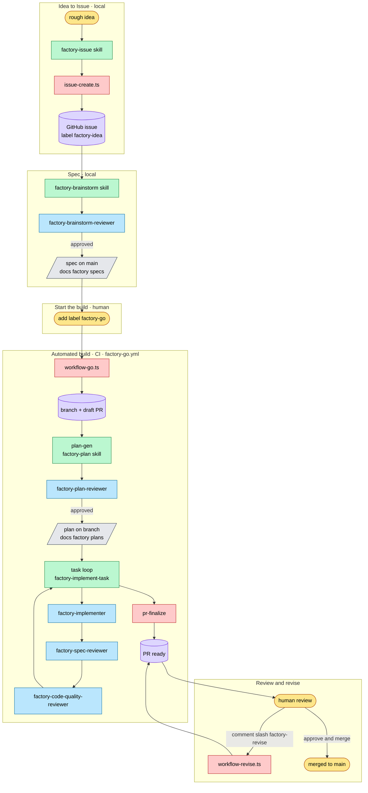
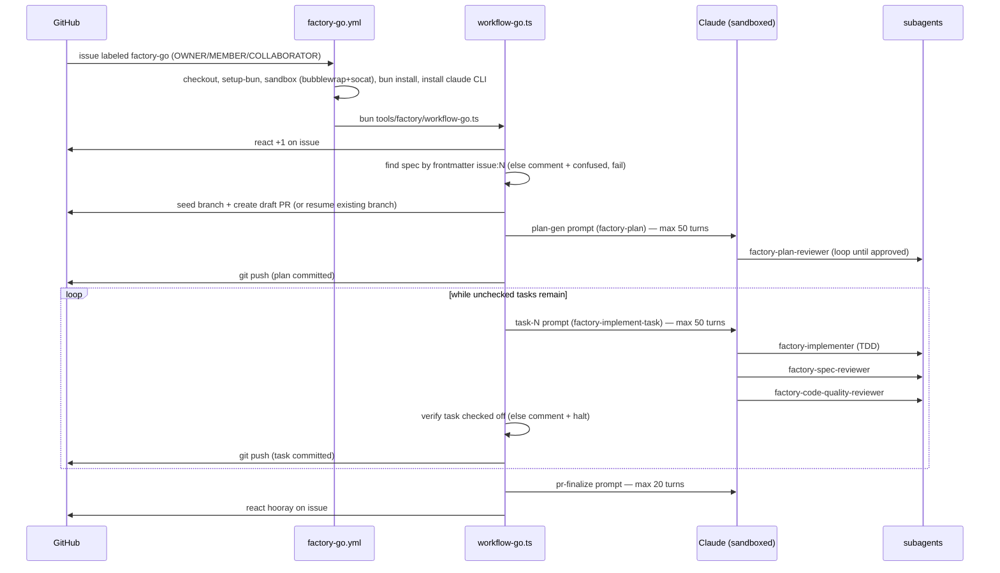

# The AI Factory — Process Guide

The "AI factory" is a pipeline that turns an idea into a merged pull request with
as little human keystroke as possible. A human shapes intent (an issue and a spec)
and reviews the result; everything between — planning, implementation, and review —
runs autonomously in CI. The pipeline is assembled from four kinds of part, glued
together by Bun/TypeScript scripts:

- **GitHub (control plane).** Issues, labels, PR comments, and reactions are the
  signalling layer. A label starts a build; a comment triggers a revision; emoji
  reactions report progress.
- **GitHub Actions workflows.** Two workflows (`factory-go`, `factory-revise`)
  watch for those signals and run the orchestrator scripts in an OS-sandboxed
  runner.
- **Skills.** Markdown procedures a Claude session follows for one stage
  (`factory-issue`, `factory-brainstorm`, `factory-plan`, `factory-implement-task`,
  `factory-tdd`, `factory-retro`, `docs-factory`).
- **Subagents.** Single-purpose Claude agents — one implementer and four reviewers
  — each with a narrow tool surface and a fixed return contract.

Bun/TypeScript scripts under `tools/factory/` orchestrate the automated stages,
build the per-stage prompts, and wrap `git`/`gh`.

---

## The big picture



Legend: 🟨 human action · 🟪 GitHub object · 🟩 skill · 🟦 subagent · 🟥 script · ⬜ artifact.
(You cannot render mermaid here — preview the file and report any diagram that fails to parse.)

---

## Stage-by-stage walkthrough

### 1. Idea → Issue — _local, human-driven_

Invoke the **`factory-issue`** skill (it owns all issue creation in this repo — never
`gh issue create` directly). It runs a mini-brainstorm (feature or bug? then a few
one-at-a-time questions) and files the issue via **`tools/factory/issue-create.ts`**,
which applies the labels the pipeline depends on: **`factory-idea`** on every issue,
plus **`bug`** when the type is a bug. Output: a GitHub issue number.

### 2. Issue → Spec — _local, human-driven_

Invoke the **`factory-brainstorm`** skill with the issue number. It explores the
repo, runs a one-question-at-a-time dialogue, proposes 2–3 approaches, and presents
the design section-by-section. It then dispatches the **`factory-brainstorm-reviewer`**
subagent and loops on `changes-requested` until `approved`, gets human sign-off, and
commits+pushes the spec to `main` via **`tools/factory/spec-author.ts --commit-spec`**.

- Artifact: `docs/factory/specs/<YYYY-MM-DD-HHMM>--issue-<N>--<slug>--design.md`
- Frontmatter (required): `name`, `description`, `status: draft`, `issue: N`
  (a `factory-spec-frontmatter` hook validates `issue:` on write).
- The skill ends by printing the start hint:
  `gh issue edit N --add-label factory-go`.

### 3. Start the build — _human_

Adding the **`factory-go`** label to the issue is the handoff from local work to CI.

### 4. The automated build — _CI, `factory-go.yml`_

The `factory-go` workflow runs **`tools/factory/workflow-go.ts`**, which drives the
whole build (detailed sequence below). The key invariants:

- **The plan's `## Task Checklist` is the single source of truth** for task
  completion. The orchestrator reads and flips only those `- [ ] Task N:` lines.
- **Plan is reviewed before any code** — `factory-plan-reviewer` must return
  `approved` before the task loop begins.
- **Per task: spec-review precedes quality-review** — `factory-implement-task`
  dispatches `factory-implementer`, then `factory-spec-reviewer` (does it match the
  task?), then `factory-code-quality-reviewer` (is it good?), iterating until both
  approve. The implementer follows **`factory-tdd`** (failing test → minimal code →
  green).
- **Idempotent re-trigger** — if the branch already exists on origin (label
  re-applied), the run resumes it instead of seeding a duplicate.
- Each phase streams a JSONL log to `.factory/logs/<run-id>--<step>.jsonl`, uploaded
  as the `factory-logs-<run_id>` artifact.

### 5. Review & revise — _human + CI_

The build leaves a PR. A human reviews it. Commenting **`/factory-revise`** on the PR
triggers **`factory-revise.yml`** → **`tools/factory/workflow-revise.ts`**, which
gathers the PR's review feedback, invokes Claude to revise on the PR's head branch,
and pushes the new commits. A counter in `.factory/revise-count-<pr>.txt` caps this
at 5 iterations. When satisfied, the human approves and merges.

---

## The automated build, in detail

The `factory-go` path, mirroring the actual step order in `workflow-go.ts`:



Exact `workflow-go.ts` order: (1) +1 reaction → (2) match spec to issue → (3) seed
branch + draft PR (idempotent) → (4) plan generation + push → (5) task loop
(implement → review → verify checkbox → push, per task) → (6) PR finalize →
(7) hooray reaction.

`workflow-revise.ts` order: (1) +1 on the comment → (2) increment + enforce the
5-revision cap → (3) gather PR comments/reviews → (4) invoke Claude to revise →
(5) push new commits to the PR branch → (6) hooray on the comment.

---

## Reference tables

### Skills

| Skill                    | Stage        | Role                                                                          |
| ------------------------ | ------------ | ----------------------------------------------------------------------------- |
| `factory-issue`          | Idea → Issue | Mini-brainstorm; files the issue via `issue-create.ts` with factory labels    |
| `factory-brainstorm`     | Issue → Spec | Dialogue → design → spec on `main`; reviewed by `factory-brainstorm-reviewer` |
| `factory-plan`           | Build (CI)   | Spec → checkbox plan; reviewed by `factory-plan-reviewer`                     |
| `factory-implement-task` | Build (CI)   | Drives one task: implementer → spec-review → quality-review                   |
| `factory-tdd`            | Build (CI)   | TDD discipline preloaded into the implementer                                 |
| `factory-retro`          | Post-run     | Mines run logs for friction; routes findings to fixes                         |
| `docs-factory`           | Maintenance  | Regenerates this guide from the live pipeline                                 |

### Subagents

| Subagent                        | Role                             | Returns                                             | Model  |
| ------------------------------- | -------------------------------- | --------------------------------------------------- | ------ |
| `factory-implementer`           | Implements one task via TDD      | DONE / DONE_WITH_CONCERNS / NEEDS_CONTEXT / BLOCKED | sonnet |
| `factory-spec-reviewer`         | Spec/task compliance (read-only) | compliant / issues w/ file:line                     | sonnet |
| `factory-code-quality-reviewer` | Code quality (read-only)         | approved / Critical·Important·Minor                 | sonnet |
| `factory-brainstorm-reviewer`   | Spec-doc review (read-only)      | approved / changes-requested                        | opus   |
| `factory-plan-reviewer`         | Plan-doc review (read-only)      | approved / changes-requested                        | opus   |

### GitHub Actions

| Workflow             | Trigger (`on` + `if`)                                                                                               | Runs                                   |
| -------------------- | ------------------------------------------------------------------------------------------------------------------- | -------------------------------------- |
| `factory-go.yml`     | `issues: [labeled]` where `label.name == 'factory-go'` and author is OWNER/MEMBER/COLLABORATOR                      | `bun tools/factory/workflow-go.ts`     |
| `factory-revise.yml` | `issue_comment: [created]` on a PR where body contains `/factory-revise` and commenter is OWNER/MEMBER/COLLABORATOR | `bun tools/factory/workflow-revise.ts` |

Both runners: checkout → `setup-bun` → install bubblewrap+socat and relax the
AppArmor userns restriction (so the bwrap OS sandbox for the Claude steps can init)
→ `bun install --frozen-lockfile` → install the `claude` CLI → run the orchestrator
→ upload `.factory/logs/`.

### Scripts

| Script               | Role                                                                           |
| -------------------- | ------------------------------------------------------------------------------ |
| `workflow-go.ts`     | Orchestrates the full build (spec → plan → task loop → PR finalize)            |
| `workflow-revise.ts` | Orchestrates the PR revision loop (capped at 5)                                |
| `plan-gen.ts`        | Builds the plan-generation prompt (`buildPrompt(specPath, planPath, issue)`)   |
| `task-run.ts`        | Builds a single-task prompt (`buildTaskPrompt(...)`)                           |
| `pr-finalize.ts`     | Builds the PR-body finalize prompt (`buildFinalizePrompt(prNumber, planPath)`) |
| `issue-create.ts`    | CLI to create a labelled factory issue                                         |
| `spec-author.ts`     | CLI to read an issue / commit + push a spec; slug helpers                      |
| `lib/claude.ts`      | Spawn the Claude CLI (`CI_SANDBOX` settings), stream-json logging, summaries   |
| `lib/github.ts`      | Thin `gh`/`git` exec wrappers; reaction/comment/PR arg builders                |
| `lib/plan.ts`        | Parse the plan; find/check off tasks in the `## Task Checklist`                |

### Labels & commands

| Trigger                           | Effect                                                            |
| --------------------------------- | ----------------------------------------------------------------- |
| Label `factory-idea`              | Applied to every factory issue at creation (`bug` added for bugs) |
| Label `factory-go` on an issue    | Starts the automated build (`factory-go.yml`)                     |
| Comment `/factory-revise` on a PR | Starts a revision pass (`factory-revise.yml`), max 5              |

---

## Quick start

```bash
# 1. File the issue (local) — via the skill, not gh issue create
#    invoke the factory-issue skill, answer its questions → returns issue N

# 2. Author the spec (local) — via the skill
#    invoke factory-brainstorm with issue N → spec committed+pushed to main

# 3. Start the automated build
gh issue edit N --add-label factory-go

# 4. (optional) Ask the bot to revise after review — comment on the PR:
#    /factory-revise

# 5. Approve & merge the PR when satisfied.
```
