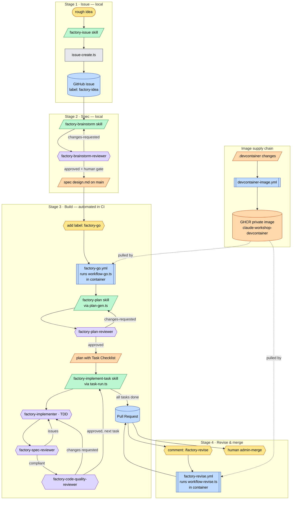

# The AI Factory — Process Guide

The **AI factory** turns a rough idea into a reviewed, merge-ready pull request
through a chain of local (human-driven) and automated (CI) stages. A human shapes
the idea into an issue and a design spec locally; then a single GitHub label hands
off to GitHub Actions, which plans the work, implements it task-by-task behind two
independent reviewers, and opens a PR — all running **inside one
egress-firewalled container image** with Claude in **auto permission mode**.

The factory is built from four kinds of part, glued together by Bun/TypeScript
scripts under `tools/factory/`:

- **GitHub (control plane)** — issues, labels, PR comments, and reactions are the
  state machine. A label starts a build; a comment triggers a revision; reactions
  (👍/🎉/😕) report progress.
- **GitHub Actions workflows** (`.github/workflows/factory-*.yml`,
  `devcontainer-image.yml`) — the automated runners. They run the orchestrator
  scripts inside the published devcontainer image.
- **Skills** (`.claude/skills/factory-*/SKILL.md`) — the procedures a Claude
  session follows at each stage (issue → spec → plan → implement → retro → docs).
- **Subagents** (`.claude/agents/factory-*.md`) — focused, single-purpose Claude
  agents: one implementer and four read-only reviewers.

> The mermaid diagrams below could not be rendered while writing this guide —
> preview them in your editor and report any diagram that fails to parse.

---

## The big picture



**Legend:** 🟨 human action · 🟦 GitHub object/workflow · 🟩 skill · 🟪 subagent ·
⬜ script · 🟧 artifact.

---

## Stage-by-stage walkthrough

### Stage 1 · Issue — _local, human-driven_

- **Skill:** `factory-issue`. A mini-brainstorm: asks feature-or-bug, then a few
  one-at-a-time questions, then files the issue via `tools/factory/issue-create.ts`.
- **Labels applied:** every issue gets **`factory-idea`**; bugs additionally get
  **`bug`** (`issue-create.ts` `labelsFor()`). The script ensures the labels exist
  before creating the issue.
- **Invariant:** issues are **never** created with `gh issue create` directly —
  always through this skill, so the format and labels the pipeline depends on are
  consistent.
- **Output:** a GitHub issue (the returned number feeds Stage 2).

### Stage 2 · Spec — _local, human-driven_

- **Skill:** `factory-brainstorm`. Reads the issue
  (`spec-author.ts --issue <N>`), runs a one-question-at-a-time design dialogue,
  proposes 2–3 approaches, then writes the design section-by-section.
- **Reviewer:** `factory-brainstorm-reviewer` (Opus, read-only) checks the spec for
  internal consistency, scope, YAGNI, and factory-readiness; returns **`approved`**
  or **`changes-requested`**. The skill loops until approved, then a **human gate**.
- **Artifact:** `docs/factory/specs/<stamp>--issue-<N>--<slug>--design.md` with
  frontmatter `name`, `description`, `status: draft`, `issue: N`. Committed and
  **pushed to `main`** (so the CI build can find it).
- **Handoff hint:** `gh issue edit N --add-label factory-go`.

### Stage 3 · Build — _automated in CI_

Triggered by adding the **`factory-go`** label. `factory-go.yml` runs
`workflow-go.ts` inside the container. Sub-stages:

- **Plan generation** — `plan-gen.ts` invokes Claude with the `factory-plan` skill
  to convert the spec into a plan. `factory-plan-reviewer` (Opus, read-only)
  checks it against the spec for coverage, decomposition, and **fresh-context
  buildability** (each task implementable alone); returns `approved` /
  `changes-requested`.
  - **Artifact:** `docs/factory/plans/<stamp>--issue-<N>--<slug>--plan.md`. Its
    **`## Task Checklist`** (`- [ ] Task <n>: …` lines) is the **single source of
    truth** for task completion — the orchestrator reads and flips only these lines.
- **Task loop** — for each unchecked task, `task-run.ts` invokes Claude with the
  `factory-implement-task` skill, which dispatches:
  1. `factory-implementer` (Sonnet) — implements **one** task via **TDD** (the
     `factory-tdd` skill: failing test → minimal code → green), self-reviews,
     commits. Reports `DONE` / `DONE_WITH_CONCERNS` / `NEEDS_CONTEXT` / `BLOCKED`.
  2. `factory-spec-reviewer` (Sonnet, read-only) — **spec compliance first**:
     nothing missing, nothing extra.
  3. `factory-code-quality-reviewer` (Sonnet, read-only) — quality, **only after**
     spec review passes.
  - **Invariants:** spec-review-**before**-quality-review, never reordered; a
    reviewer that finds issues sends the implementer back; on success the task's
    `- [ ]` flips to `- [x]` and is committed. If a task fails to check off, the
    orchestrator comments on the issue and **halts**.

### Stage 4 · Revise & merge

- **Revise:** commenting **`/factory-revise`** on the PR fires `factory-revise.yml`
  → `workflow-revise.ts`. It gathers the PR's review comments and has Claude apply
  the changes on the PR's head branch, then pushes. Capped at **5 iterations** per
  PR (`REVISE_CAP`).
- **Merge:** a human performs the final **admin merge** (branch protection requires
  an approving review; the auto-mode classifier correctly blocks an agent from
  bypassing that protection). Use a **merge commit**.

---

## The runtime boundary (what changed, and why it matters)

Every Claude invocation in CI runs through the shared **`CI_SANDBOX`** profile
(`tools/factory/lib/claude.ts`): `--permission-mode auto`, `--model opus`, and
`--settings tools/factory/ci.settings.json`. The protection is **three layers**:

1. **The container.** `factory-go` / `factory-revise` run their whole job _inside_
   the published image
   `ghcr.io/jost-kuenzel/claude-workshop-devcontainer:latest`, pulled with
   `container.credentials` (`github.repository_owner` / `GITHUB_TOKEN`), as the
   **non-root `dev` user** (`--user 1000`), with only `--cap-add=NET_ADMIN
--cap-add=NET_RAW`.
2. **The egress firewall.** The first step inside the job is `sudo
/usr/local/bin/init-firewall.sh` (baked into the image) — a default-DROP
   iptables/ipset allowlist that self-verifies and **fails closed**. It is
   programmed _after_ checkout (which needs GitHub egress) and _before_ `bun
install` and the orchestrator.
3. **Auto mode.** Claude's server-side classifier reviews each action before it
   runs. `tools/factory/ci.settings.json` is now an **`autoMode` trusted-infra
   config** (the repo + `thesimpsonsapi.com`), keeping the built-in `$defaults`
   (force-push, push-to-main, `curl | bash`, data-exfil blocks) in force.

This **replaces** the old bare-runner setup: `bubblewrap` + `socat`, the AppArmor
`apparmor_restrict_unprivileged_userns` sysctl, the `curl … claude.ai/install.sh |
bash` install, and `setup-bun` are all **gone** — baked into the image.

### Image supply chain

`devcontainer-image.yml` builds `.devcontainer/` and pushes the **private** GHCR
image, tagged `:latest` and `:<sha>`. It triggers on `push` to `main` touching
`.devcontainer/**`, or manually via `workflow_dispatch`. The factory jobs pull
`:latest`. (Built `linux/amd64` only — the runner arch and only consumer; local
arm64 Macs build the same Dockerfile via `@devcontainers/cli` / `bun run sandbox`.)

---

## The automated build, in detail

The `factory-go` orchestration (`workflow-go.ts`), in its **actual step order**:

```mermaid
sequenceDiagram
    autonumber
    participant GH as GitHub
    participant WF as factory-go.yml (container)
    participant ORCH as workflow-go.ts
    participant CLAUDE as Claude (auto mode, opus)
    participant REV as Reviewers

    GH->>WF: issue labeled factory-go
    WF->>WF: checkout → init-firewall.sh → git config → bun install
    WF->>ORCH: bun tools/factory/workflow-go.ts
    ORCH->>GH: react 👍 on issue
    ORCH->>ORCH: find spec (frontmatter issue: N)
    alt no matching spec
        ORCH->>GH: comment "no spec found" + react 😕
    end
    ORCH->>GH: title→slug→branch; seed commit; push; open PR (Closes #N)
    Note over ORCH: idempotency — resume existing branch if re-triggered

    ORCH->>CLAUDE: plan generation (factory-plan skill, maxTurns 50)
    CLAUDE->>REV: factory-plan-reviewer (approved / changes-requested)
    ORCH->>GH: git push (plan committed)

    loop each unchecked task in the Task Checklist
        ORCH->>CLAUDE: implement task (factory-implement-task, maxTurns 50)
        CLAUDE->>REV: factory-implementer (TDD)
        REV->>REV: factory-spec-reviewer (compliance FIRST)
        REV->>REV: factory-code-quality-reviewer (quality)
        Note over REV: loop back to implementer until both approve
        CLAUDE->>ORCH: flip - [ ] → - [x], commit
        alt task did not check off
            ORCH->>GH: comment "task N did not complete" + halt
        end
        ORCH->>GH: git push
    end

    ORCH->>CLAUDE: finalize PR body (pr-finalize.ts, maxTurns 20)
    ORCH->>GH: react 🎉 on issue
    WF->>GH: upload .factory/logs/ artifact (always)
```

The `factory-revise` path (`workflow-revise.ts`): react 👍 on the comment →
increment the per-PR revise counter and enforce the cap of 5 → gather PR
comments + reviews → record HEAD, have Claude apply revisions (maxTurns 30) →
push to the head branch **only if a commit landed** (else comment that nothing
changed) → react 🎉.

---

## Reference tables

### Skills

| Skill                    | Stage               | What it does                                       |
| ------------------------ | ------------------- | -------------------------------------------------- |
| `factory-issue`          | Issue (local)       | Idea → labeled GitHub issue via `issue-create.ts`  |
| `factory-brainstorm`     | Spec (local)        | Issue → reviewed design spec committed to `main`   |
| `factory-plan`           | Build (CI)          | Spec → checkbox task plan (single source of truth) |
| `factory-implement-task` | Build (CI)          | One task → TDD implementation behind two reviewers |
| `factory-tdd`            | Build (CI)          | Test-first protocol used inside the implementer    |
| `factory-retro`          | Post-run (local)    | Mine a run's logs for learnings + routed fixes     |
| `docs-factory`           | Maintenance (local) | Regenerate this guide from live sources            |

### Subagents

| Subagent                        | Model  | Role                                 | Verdicts                                            |
| ------------------------------- | ------ | ------------------------------------ | --------------------------------------------------- |
| `factory-implementer`           | Sonnet | Implements one task via TDD; commits | DONE / DONE_WITH_CONCERNS / NEEDS_CONTEXT / BLOCKED |
| `factory-spec-reviewer`         | Sonnet | Read-only spec/task compliance       | spec-compliant / issues                             |
| `factory-code-quality-reviewer` | Sonnet | Read-only quality (after spec)       | approved / changes-requested                        |
| `factory-brainstorm-reviewer`   | Opus   | Read-only spec-doc review            | approved / changes-requested                        |
| `factory-plan-reviewer`         | Opus   | Read-only plan-vs-spec review        | approved / changes-requested                        |

### GitHub Actions

| Workflow                 | Trigger                                                                                                      | Runs                                |
| ------------------------ | ------------------------------------------------------------------------------------------------------------ | ----------------------------------- |
| `factory-go.yml`         | `issues: [labeled]` + `if` label `factory-go` & author OWNER/MEMBER/COLLABORATOR                             | `workflow-go.ts` (in container)     |
| `factory-revise.yml`     | `issue_comment: [created]` + `if` body contains `/factory-revise` on a PR & author OWNER/MEMBER/COLLABORATOR | `workflow-revise.ts` (in container) |
| `devcontainer-image.yml` | `push` to `main` on `.devcontainer/**`, or `workflow_dispatch`                                               | `docker build-push` → GHCR          |

### Scripts (`tools/factory/`)

| Script               | Role                                                              |
| -------------------- | ----------------------------------------------------------------- |
| `workflow-go.ts`     | **Orchestrator** — spec → branch/PR → plan → task loop → finalize |
| `workflow-revise.ts` | **Orchestrator** — gather feedback → revise → push (cap 5)        |
| `plan-gen.ts`        | Helper — invokes Claude with `factory-plan` to write the plan     |
| `task-run.ts`        | Helper — invokes Claude with `factory-implement-task` per task    |
| `pr-finalize.ts`     | Helper — rewrites the PR body from plan + commit log              |
| `issue-create.ts`    | Helper — creates the labeled issue (factory-issue)                |
| `spec-author.ts`     | Helper — reads issue JSON / commits+pushes the spec               |
| `lib/claude.ts`      | `CI_SANDBOX` profile + `runClaude` (auto mode, opus, settings)    |

### Labels & commands

| Trigger                   | Effect                                      | Defined in                      |
| ------------------------- | ------------------------------------------- | ------------------------------- |
| Label `factory-idea`      | Marks every factory issue (features + bugs) | `issue-create.ts` `labelsFor()` |
| Label `bug`               | Added to bug issues                         | `issue-create.ts` `labelsFor()` |
| Label `factory-go`        | **Starts the automated build**              | `factory-go.yml` `if:`          |
| Comment `/factory-revise` | Revises the PR (≤5×)                        | `factory-revise.yml` `if:`      |

---

## Quick start

```bash
# 1. Shape an idea into an issue (local Claude session)
#    → invoke the factory-issue skill

# 2. Turn the issue into a reviewed spec on main (local)
#    → invoke the factory-brainstorm skill  (issue number N)

# 3. Start the automated build
gh issue edit N --add-label factory-go

# 4. (optional) Ask the CI to revise the resulting PR
#    → comment on the PR:  /factory-revise  <what to change>

# 5. Review and admin-merge the PR yourself (merge commit)
gh pr merge <PR> --merge --admin --delete-branch

# Bootstrap / refresh the container image when .devcontainer/** changes:
gh workflow run devcontainer-image.yml
```

> First-run note: the GHCR image must exist before a factory job pulls it. After
> changing `.devcontainer/**`, let `devcontainer-image.yml` publish `:latest`
> (it auto-fires on merge to `main`, or run it via `workflow_dispatch`) before
> labeling an issue `factory-go`.
