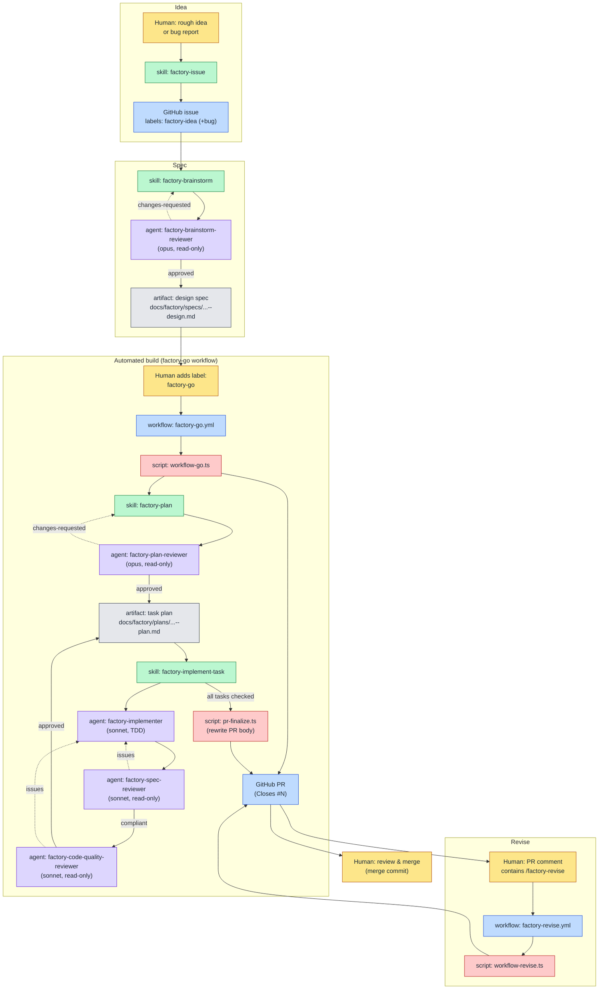
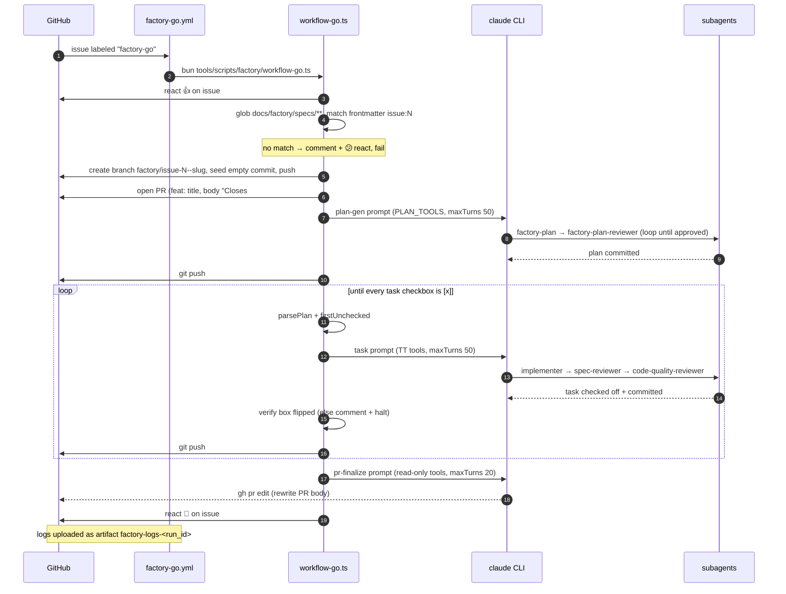

# The AI Factory — Process Guide

The **AI factory** turns a rough idea into a merged pull request through a chain of
small, single-purpose steps. The early stages are **human-driven and local** — you
run them inside a Claude Code session, one question at a time, until a reviewed
artifact is committed to `main`. A single label then flips the work into a
**fully automated CI build** that plans, implements, reviews, and opens a PR on its
own. A PR comment lets you ask the automation for another revision round.

The factory is built from four kinds of part, glued together by Bun/TypeScript
scripts:

- **GitHub (the control plane)** — issues, labels, and PR comments are the signals
  that move work between stages. A label or a comment substring is all it takes to
  hand off to the automation.
- **GitHub Actions workflows** — two YAML workflows (`factory-go`, `factory-revise`)
  watch for those signals and launch the CI orchestrators.
- **Skills** — `factory-*` skills encode the _how_ of each stage (interview, write a
  spec, decompose a plan, implement one task). They run in a Claude session, whether
  you invoke them locally or CI invokes them headlessly.
- **Subagents** — read-only reviewers and a single-task implementer, dispatched by
  the skills. Reviewers return `approved` / `changes-requested`; the implementer
  writes code via TDD.

The connective tissue is a set of `tools/scripts/factory/*.ts` Bun scripts: two
orchestrators (`workflow-go.ts`, `workflow-revise.ts`) plus helpers that create
issues, author specs, parse plans, and drive the `claude` and `gh` CLIs.

> The diagrams below are Mermaid. This guide could not render them — please preview
> the rendered Markdown and report any diagram that fails to parse so it can be fixed.

---

## The big picture



**Legend:** 🟡 human action · 🔵 GitHub object · 🟢 skill · 🟣 subagent · 🔴 script · ⬜ committed artifact.

---

## Stage-by-stage walkthrough

### 1. Idea → issue · _local, human-driven_

- **Skill:** `factory-issue`. A mini-brainstorm: asks feature-or-bug, then a few
  one-at-a-time questions to nail the core.
- **Script:** `tools/scripts/factory/issue-create.ts` files the issue via `gh`. Feature
  bodies use `## What / ## Why / ## Constraints`; bug bodies use
  `## What's broken / ## Expected / ## Where`.
- **Labels:** every factory issue gets **`factory-idea`**; bugs additionally get
  **`bug`** (`labelsFor()` in `issue-create.ts`).
- **Invariant:** never run `gh issue create` directly — always route through the
  skill so the format and labels the pipeline depends on are correct.

### 2. Issue → spec · _local, human-driven_

- **Skill:** `factory-brainstorm`. Guided dialogue → 2–3 approaches →
  section-by-section design → spec → review loop → human gate → commit+push.
- **Reviewer:** dispatches **`factory-brainstorm-reviewer`** (opus, read-only). It
  returns `approved` or `changes-requested` with blocking Issues and advisory
  Recommendations. Loop until `approved`; the spec is committed only after that.
- **Artifact:** `docs/factory/specs/<YYYY-MM-DD-HHMM>--issue-<N>--<slug>--design.md`,
  with frontmatter `name`, `description`, `status: draft`, `issue: N`.
- **Commit + push:** `bun tools/scripts/factory/spec-author.ts --commit-spec <path>`. The
  push matters — the CI build finds the spec by globbing `main`.
- **Handoff hint printed by the skill:**
  `Spec on main. To start implementation: gh issue edit N --add-label factory-go`

### 3. The `factory-go` label · _the human gate into automation_

Adding the **`factory-go`** label to the issue is the single switch that starts the
automated build. Everything below runs in GitHub Actions with no further human input
until the PR is open.

### 4. Spec → plan · _automated / CI_

- **Skill:** `factory-plan`, dispatched by the orchestrator via
  `tools/scripts/factory/plan-gen.ts` (tool allowlist `PLAN_TOOLS`).
- **Reviewer:** dispatches **`factory-plan-reviewer`** (opus, read-only) to check the
  plan against its spec for completeness, fresh-context buildability, decomposition,
  and structure. Loop until `approved`; commit only then.
- **Artifact:** `docs/factory/plans/<YYYY-MM-DD-HHMM>--issue-<N>--<slug>--plan.md`,
  frontmatter `issue: N` and `spec: <path>`.
- **Invariant — the `## Task Checklist` is the single source of truth.** The plan has
  a `## Task Checklist` (one `- [ ] Task <n>: <title>` per task), a `---` separator,
  then a `### Task <n>:` detail section per task. The orchestrator drives its task
  loop entirely off the checkboxes in this section.

### 5. Plan → code, one task at a time · _automated / CI_

For each unchecked task, the orchestrator dispatches the `factory-implement-task`
skill (via `tools/scripts/factory/task-run.ts`), which runs a strict three-agent sequence:

1. **`factory-implementer`** (sonnet) — implements exactly one task via TDD
   (red → green → refactor; the `factory-tdd` skill is preloaded into it). It writes
   tests and code and commits its own work. It reports one of **DONE /
   DONE_WITH_CONCERNS / NEEDS_CONTEXT / BLOCKED**. It receives the _full task text_,
   not the plan file.
2. **`factory-spec-reviewer`** (sonnet, read-only) — checks the diff against the
   task: nothing missing, nothing over-engineered. Issues → implementer fixes →
   re-review.
3. **`factory-code-quality-reviewer`** (sonnet, read-only) — only after spec review
   is clean, assesses correctness, decomposition, testing, and clarity.

- **Invariant — spec review before quality review. Never reorder.** Both reviewers
  are read-only; only the implementer changes files.
- When both reviews pass, the skill flips this task's `- [ ]` to `- [x]` in the
  `## Task Checklist` and commits `factory: complete task <N> — <title>`. The
  orchestrator verifies the box flipped; if not, it halts the run and comments on the
  issue. A persistent blocker (~3 rounds) is surfaced as **BLOCKED** rather than
  ping-ponging the turn budget.

### 6. PR finalize · _automated / CI_

After the last task is checked, `tools/scripts/factory/pr-finalize.ts` runs Claude with a
**read-only** allowlist (`Read, Grep, Glob, Bash(git log:*), Bash(gh pr edit:*)`) to
rewrite the PR body into a Summary + Test plan synthesized from the plan and commit
log. The orchestrator then reacts 🎉 on the issue.

### 7. Revise → re-run · _automated / CI, human-triggered_

Comment **`/factory-revise`** on the PR to ask the automation for another pass. The
`factory-revise` workflow gathers the PR's review/comment bodies and dispatches Claude
to apply them on the PR branch. A per-PR counter (`.factory/revise-count-<PR>.txt`)
enforces a hard cap of **5** revision rounds.

### 8. Merge · _local, human-driven_

A human reviews and merges the PR using the **merge commit** strategy. The PR body
`Closes #N` ties it back to the originating issue.

---

## The automated build, in detail

This sequence mirrors the actual step order in `tools/scripts/factory/workflow-go.ts`.



---

## Reference tables

### Skills

| Skill                    | Stage                   | Consumes → Produces                                         |
| ------------------------ | ----------------------- | ----------------------------------------------------------- |
| `factory-issue`          | idea → issue (local)    | dialogue → GitHub issue (`factory-idea` [+`bug`])           |
| `factory-brainstorm`     | issue → spec (local)    | issue → committed `…--design.md`, prints `factory-go` hint  |
| `factory-plan`           | spec → plan (CI)        | spec path → committed `…--plan.md` with `## Task Checklist` |
| `factory-implement-task` | plan → code (CI)        | one task → code + checked-off task                          |
| `factory-tdd`            | embedded in implementer | failing test → minimal code → green                         |
| `docs-factory`           | meta / docs             | live factory → `docs/factory/factory-process-guide.md`      |

### Subagents

| Subagent                        | Role                             | Model  | Returns                                             |
| ------------------------------- | -------------------------------- | ------ | --------------------------------------------------- |
| `factory-brainstorm-reviewer`   | review spec vs factory-readiness | opus   | `approved` / `changes-requested`                    |
| `factory-plan-reviewer`         | review plan vs spec              | opus   | `approved` / `changes-requested`                    |
| `factory-implementer`           | implement one task via TDD       | sonnet | DONE / DONE_WITH_CONCERNS / NEEDS_CONTEXT / BLOCKED |
| `factory-spec-reviewer`         | code vs task (compliance)        | sonnet | compliant / issues found                            |
| `factory-code-quality-reviewer` | quality after spec pass          | sonnet | approved / changes required                         |

### GitHub Actions (workflow → trigger → script)

| Workflow             | Trigger (`on:` + `if:`)                                                                                                                | Runs                                     |
| -------------------- | -------------------------------------------------------------------------------------------------------------------------------------- | ---------------------------------------- |
| `factory-go.yml`     | `issues: [labeled]` and `if: github.event.label.name == 'factory-go'`                                                                  | `bun tools/scripts/factory/workflow-go.ts`     |
| `factory-revise.yml` | `issue_comment: [created]` and `if: github.event.issue.pull_request != null && contains(github.event.comment.body, '/factory-revise')` | `bun tools/scripts/factory/workflow-revise.ts` |

Both upload `.factory/logs/` as artifact `factory-logs-<run_id>` (`if: always()`).

### Scripts (script → role)

| Script               | Role                                                                        |
| -------------------- | --------------------------------------------------------------------------- |
| `workflow-go.ts`     | **orchestrator** — label → branch/PR → plan → task loop → finalize          |
| `workflow-revise.ts` | **orchestrator** — `/factory-revise` → apply review feedback → push (cap 5) |
| `plan-gen.ts`        | dispatch `factory-plan` with `PLAN_TOOLS`; build plan prompt                |
| `task-run.ts`        | dispatch `factory-implement-task`; build single-task prompt                 |
| `pr-finalize.ts`     | rewrite PR body from plan + commit log (read-only tools)                    |
| `issue-create.ts`    | create labelled issues; `labelsFor()`, feature/bug bodies                   |
| `spec-author.ts`     | spec filenames, frontmatter, `slugify`, `--commit-spec`                     |
| `plan.ts`            | `parsePlan` / `firstUnchecked` / `checkOffTask` over the checklist          |
| `github.ts`          | `gh` argument builders + `runGh` / `runProcess` (dry-run aware)             |
| `claude.ts`          | spawn `claude`, stream-json logging to `.factory/logs/`, result summary     |

### Labels & commands (trigger → effect)

| Trigger                      | Effect                                                          |
| ---------------------------- | --------------------------------------------------------------- |
| label `factory-idea`         | marks an issue as factory work (all issues)                     |
| label `bug`                  | marks the issue as a bug (added alongside `factory-idea`)       |
| label `factory-go`           | **starts the automated build** (`factory-go.yml`)               |
| PR comment `/factory-revise` | **starts a revision round** (`factory-revise.yml`), capped at 5 |

---

## Quick start

```bash
# 1. Idea → issue (in a Claude Code session)
/factory-issue            # interview → files issue with factory-idea [+bug]

# 2. Issue → reviewed spec on main (in a Claude Code session)
/factory-brainstorm       # dialogue → spec → reviewer loop → commit + push

# 3. Start the automated build
gh issue edit <N> --add-label factory-go
#   → CI: branch + PR → plan (+review) → per-task implement+review loop → finalize PR

# 4. Ask for another pass (comment on the PR), repeat as needed (max 5)
#   /factory-revise  — applies the open review feedback on the PR branch

# 5. Review and merge the PR (merge commit strategy)
gh pr merge <PR> --merge
```

> Keep this guide fresh: when the pipeline changes, re-run the `docs-factory` skill —
> it re-derives the whole guide from the live sources rather than patching prose.
