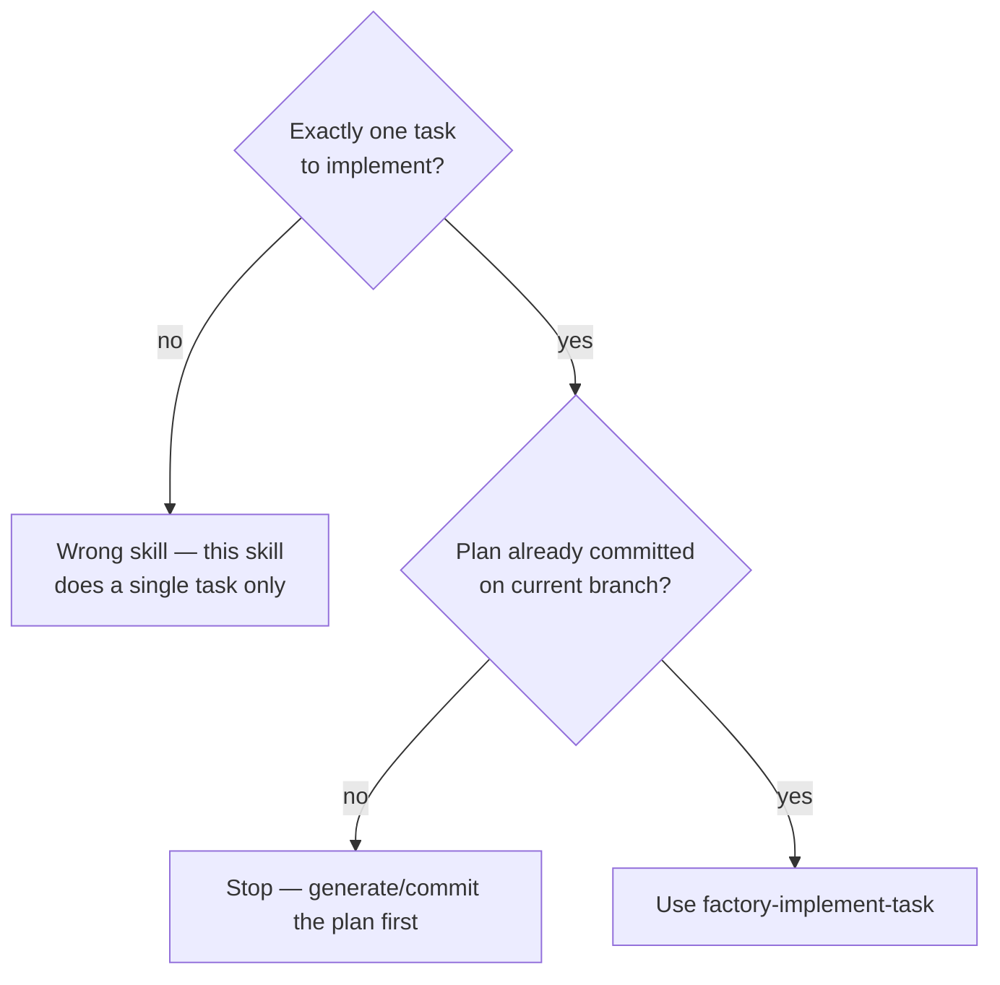
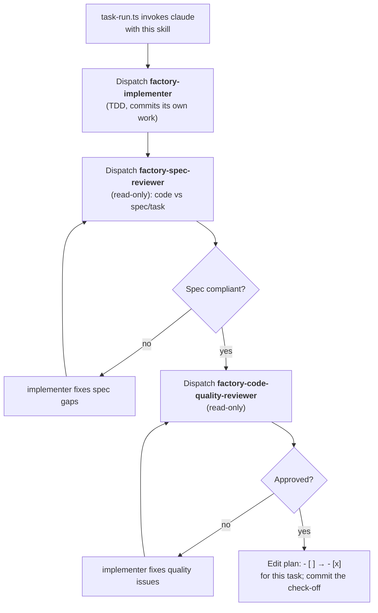

# AI Factory Implementation Plan

> **For agentic workers:** REQUIRED SUB-SKILL: Use superpowers:subagent-driven-development (recommended) or superpowers:executing-plans to implement this plan task-by-task. Steps use checkbox (`- [ ]`) syntax for tracking.

**Goal:** Build an end-to-end "AI factory": a `factory-go`-labeled GitHub issue drives Claude to plan and implement a change in a PR, humans review, and `/factory-revise` comments drive revision rounds — all orchestrated by testable TypeScript, with Claude invoked only where judgement is needed.

**Architecture:** Deterministic work (branch/PR/reactions/lint-test gating) lives in `bun`-run TypeScript under `scripts/factory/`; Claude is invoked once per logical step (plan, each task, PR-finalize, each revise) through a single CLI wrapper. Per-task progress is tracked by checking off task-level boxes in the plan file. Factory-specific skills and agents under `.claude/` are self-contained (no runtime superpowers dependency) and enforce "single task, current branch, no worktree, no PR" natively via their tool allowlists.

**Tech Stack:** Bun 1.3, TypeScript (strict), `@effect/cli` + `effect` + `@effect/platform-bun` for CLI scripts, `bun test` for unit tests, the `claude` CLI (`--print --output-format stream-json`), `gh` CLI for GitHub, GitHub Actions for triggers.

---

## Orientation for the implementer

You know almost nothing about this repo or its toolset. Read this section once before starting.

- **Package manager / runner is Bun, not npm.** Use `bun test`, `bun run lint`, `bun add`, `bun <file>.ts`. The repo's `package.json` scripts: `test` → `bun test`, `lint` → `bunx eslint`, `format` → `bunx prettier --write`. Ignore the `npm run …` phrasing in `CLAUDE.md`; the scripts are the same commands, run them with `bun run`.
- **Tests** use Bun's built-in runner: `import { test, expect, describe } from "bun:test"`. A file named `*.test.ts` anywhere is auto-discovered. Run a single file with `bun test scripts/factory/plan.test.ts`.
- **A PostToolUse hook already runs** `scripts/lint-fix.sh` (eslint --fix + prettier --write) on every file you Write/Edit. So files are auto-formatted after you touch them — do not hand-format, and do not be surprised when whitespace changes.
- **Design discipline (applies to every task):** one clear responsibility per file; separate pure logic from I/O so the logic is unit-testable. In this plan, the pure functions are the TDD targets; the thin I/O shells (spawning processes, reading stdin, touching the network) are verified with `--dry-run` runs, not unit tests.
- **TDD applies to all logic** (parsers, builders, decision functions, hooks). It does **not** apply to the prose/config artifacts — the `.claude/skills/**/SKILL.md`, `.claude/agents/*.md`, `.github/**` YAML/markdown templates. The TDD skill lists configuration files as an explicit exception. For those tasks you write the full file content and verify structurally (frontmatter parses, required fields present, file is where it should be).
- **Commit after every task** (and the plan checkboxes are flipped by `task-run.ts` in production; while _building the factory itself_ you flip them yourself per the executing skill).

### Plan-file format contract (locked decision — referenced by Tasks 2, 9, 13)

The spec says per-task progress is tracked by flipping `- [ ]` → `- [x]` in the plan file, but the plans that the factory _generates_ (via the `factory-plan` skill) also contain per-step checkboxes inside each task. To keep parsing unambiguous, **factory-generated plans have two distinct checkbox regions**:

1. A single **`## Task Checklist`** section near the top — one `- [ ] Task <n>: <title>` line per task. **This is the only source of truth for task completion.** `plan.ts` reads and writes _only_ these lines.
2. Per-task detail sections `### Task <n>: <title>` further down, which may contain per-step `- [ ]` checkboxes. `plan.ts` extracts the **body text** of these sections for the implementer prompt but never reads their checkboxes for completion state.

Example of a factory-generated plan (this is the shape `factory-plan` must emit and `plan.ts` must parse):

```markdown
# <Feature> Implementation Plan

## Task Checklist

- [ ] Task 1: Add the data model
- [ ] Task 2: Wire the API route

---

### Task 1: Add the data model

**Files:** ...

- [ ] Step 1: write failing test
- [ ] Step 2: ...

### Task 2: Wire the API route

...
```

---

## File Structure

New/changed paths, each with one responsibility:

| Path                                              | Responsibility                                                                                                                          |
| ------------------------------------------------- | --------------------------------------------------------------------------------------------------------------------------------------- |
| `scripts/factory/plan.ts`                         | Pure parsing of factory plan markdown: list tasks, find first unchecked, check off a task.                                              |
| `scripts/factory/github.ts`                       | Pure `gh` argv builders + one thin `runGh` exec wrapper honoring dry-run.                                                               |
| `scripts/factory/claude.ts`                       | Pure `claude` argv builder, auth-env resolver, log-path builder, stream-json result extractor + one thin `runClaude` spawn/tee wrapper. |
| `scripts/factory/plan-gen.ts`                     | Effect CLI entry: invoke Claude with `factory-plan` to write the plan file.                                                             |
| `scripts/factory/task-run.ts`                     | Effect CLI entry: invoke Claude on exactly one task via `factory-implement-task`; verify check-off.                                     |
| `scripts/factory/pr-finalize.ts`                  | Effect CLI entry: invoke Claude to rewrite the PR body.                                                                                 |
| `scripts/factory/workflow-go.ts`                  | Effect CLI entry for `factory-go.yml`: react, branch, PR, then plan-gen → task loop → pr-finalize.                                      |
| `scripts/factory/workflow-revise.ts`              | Effect CLI entry for `factory-revise.yml`: cap check, gather feedback, revise, commit/push.                                             |
| `scripts/factory/*.test.ts`                       | `bun test` unit tests for the pure logic above.                                                                                         |
| `.claude/hooks/factory-test-gate.ts`              | Stop hook: gate `lint`+`test`, with attempt cap. Pure `decideGate` + stdin shell.                                                       |
| `.claude/hooks/factory-spec-frontmatter.ts`       | PostToolUse hook: validate spec frontmatter `issue:`. Pure `validateSpecFrontmatter` + stdin shell.                                     |
| `.claude/hooks/*.test.ts`                         | `bun test` unit tests for the two hook decision functions.                                                                              |
| `.claude/skills/factory-tdd/SKILL.md`             | TDD discipline the implementer follows (distilled from `test-driven-development`).                                                      |
| `.claude/skills/factory-plan/SKILL.md`            | Plan generation discipline (distilled from `writing-plans`).                                                                            |
| `.claude/skills/factory-implement-task/SKILL.md`  | Single-task orchestrator (distilled from `subagent-driven-development`, per-task only).                                                 |
| `.claude/agents/factory-implementer.md`           | Implements one task via TDD; no branch/worktree/PR tools.                                                                               |
| `.claude/agents/factory-spec-reviewer.md`         | Read-only: code vs spec.                                                                                                                |
| `.claude/agents/factory-code-quality-reviewer.md` | Read-only: code quality.                                                                                                                |
| `.claude/settings.json`                           | Extended with the Stop hook + the spec-frontmatter PostToolUse hook.                                                                    |
| `.github/workflows/factory-go.yml`                | `issues.labeled` trigger → `workflow-go.ts`.                                                                                            |
| `.github/workflows/factory-revise.yml`            | `issue_comment.created` trigger → `workflow-revise.ts`.                                                                                 |
| `.github/ISSUE_TEMPLATE/factory-idea.md`          | The rough-idea issue template.                                                                                                          |
| `.github/pull_request_template.md`                | Human PR template (factory overwrites the body later).                                                                                  |

---

## Phase 0 — Project setup & open-question spikes

### Task 1: Dependencies, runtime dirs, and CLI-grammar spikes

**Files:**

- Modify: `package.json` (devDependencies)
- Modify: `.gitignore`
- Create: `scripts/factory/.gitkeep` (so the directory exists before first source file)

- [ ] **Step 1: Add the Effect dependencies**

Run:

```bash
bun add -d @effect/cli effect @effect/platform @effect/platform-bun
```

Expected: command succeeds; `package.json` `devDependencies` now lists all four. (`@effect/platform-bun` provides `BunContext`/`BunRuntime`, the Bun equivalents of the `NodeContext`/`NodeRuntime` shown in Effect's docs.)

- [ ] **Step 2: Gitignore the runtime state directory**

Append to `.gitignore` under the existing `# claude` block:

```gitignore

# ai factory runtime state
.factory/
```

Run: `git check-ignore .factory/logs/x.jsonl`
Expected: prints `.factory/logs/x.jsonl` (i.e. it is ignored).

- [ ] **Step 3: Create the scripts/factory directory**

```bash
mkdir -p scripts/factory && touch scripts/factory/.gitkeep
```

- [ ] **Step 4: Spike — pin the `claude` CLI flags this plan depends on**

This resolves the spec's Open Questions. Run each and record the answer as a comment you will reuse:

```bash
claude --help 2>&1 | grep -E -- '--allowedTools|--permission-mode|--output-format|--max-turns|--model|--print' || true
```

Expected: confirms the flags exist. **Pinned decisions for this plan (override only if `--help` contradicts them):**

- Tool scoping uses the **colon** form: `Bash(git commit:*)`, `Bash(bun:*)`. (Confirm one grant works in Step 5.)
- Non-interactive permission flag: `--permission-mode acceptEdits`.
- Streaming output: `--print --output-format stream-json --verbose`.

- [ ] **Step 5: Spike — confirm the colon Bash-scoping grammar is honored**

```bash
echo "run: git status" | claude --print --permission-mode plan \
  --allowedTools "Bash(git status:*)" --output-format stream-json --verbose 2>&1 | head -5 || true
```

Expected: the run starts (session-init event appears) and does not reject the grant syntax. If the installed CLI rejects `Bash(git status:*)` and only accepts `Bash(git status *)` (space form), note it and use the space form consistently in Tasks 12–16. **Do not change the rest of the plan blindly** — pick whichever single form this command accepts.

- [ ] **Step 6: Commit**

```bash
git add package.json .gitignore scripts/factory/.gitkeep
git commit -m "build: add Effect deps and .factory gitignore for AI factory"
```

---

## Phase 1 — Pure core libraries (TDD)

### Task 2: `plan.ts` — parse and check off factory plan tasks

**Files:**

- Create: `scripts/factory/plan.ts`
- Test: `scripts/factory/plan.test.ts`

- [ ] **Step 1: Write the failing tests**

Create `scripts/factory/plan.test.ts`:

```typescript
import { test, expect, describe } from "bun:test";
import { parsePlan, firstUnchecked, checkOffTask } from "./plan";

const SAMPLE = `# Demo Plan

## Task Checklist

- [ ] Task 1: Add the model
- [x] Task 2: Wire the route

---

### Task 1: Add the model

**Files:** src/model.ts
- [ ] Step 1: failing test

### Task 2: Wire the route

Body of task two.
`;

describe("parsePlan", () => {
  test("returns one entry per checklist line with index, title, checked", () => {
    const tasks = parsePlan(SAMPLE);
    expect(tasks).toHaveLength(2);
    expect(tasks[0]).toMatchObject({ index: 1, title: "Add the model", checked: false });
    expect(tasks[1]).toMatchObject({ index: 2, title: "Wire the route", checked: true });
  });

  test("attaches the matching ### Task N section body to each task", () => {
    const tasks = parsePlan(SAMPLE);
    expect(tasks[0].body).toContain("### Task 1: Add the model");
    expect(tasks[0].body).toContain("**Files:** src/model.ts");
    expect(tasks[0].body).not.toContain("### Task 2");
    expect(tasks[1].body).toContain("Body of task two.");
  });

  test("throws a typed error when the Task Checklist section is missing", () => {
    expect(() => parsePlan("# No checklist here\n\njust prose")).toThrow(/Task Checklist/);
  });
});

describe("firstUnchecked", () => {
  test("returns the lowest-index unchecked task", () => {
    expect(firstUnchecked(parsePlan(SAMPLE))?.index).toBe(1);
  });
  test("returns undefined when all tasks are checked", () => {
    const md = SAMPLE.replace("- [ ] Task 1", "- [x] Task 1");
    expect(firstUnchecked(parsePlan(md))).toBeUndefined();
  });
});

describe("checkOffTask", () => {
  test("flips only the targeted checklist line to checked", () => {
    const out = checkOffTask(SAMPLE, 1);
    expect(out).toContain("- [x] Task 1: Add the model");
    expect(out).toContain("- [x] Task 2: Wire the route");
    // detail-section step checkbox is untouched
    expect(out).toContain("- [ ] Step 1: failing test");
  });
  test("throws when the task index is not in the checklist", () => {
    expect(() => checkOffTask(SAMPLE, 9)).toThrow(/Task 9/);
  });
});
```

- [ ] **Step 2: Run the tests to verify they fail**

Run: `bun test scripts/factory/plan.test.ts`
Expected: FAIL — `Cannot find module "./plan"` / functions undefined.

- [ ] **Step 3: Write the minimal implementation**

Create `scripts/factory/plan.ts`:

```typescript
export interface PlanTask {
  /** 1-based task number from the checklist. */
  index: number;
  /** Title text after "Task N: " on the checklist line. */
  title: string;
  /** Whether the checklist line is checked. */
  checked: boolean;
  /** Full "### Task N: ..." detail section (heading + body), trimmed. */
  body: string;
}

export class PlanParseError extends Error {
  readonly _tag = "PlanParseError";
}

const CHECKLIST_HEADING = /^##\s+Task Checklist\s*$/m;
// Matches: "- [ ] Task 12: Some title" / "- [x] Task 12: Some title"
const CHECKLIST_LINE = /^- \[( |x)\] Task (\d+):\s*(.+?)\s*$/;

/** Extract the "### Task N: ..." section body for a given task index. */
function extractBody(markdown: string, index: number): string {
  const lines = markdown.split("\n");
  const start = lines.findIndex((l) => new RegExp(`^###\\s+Task ${index}:`).test(l));
  if (start === -1) return "";
  let end = lines.length;
  for (let i = start + 1; i < lines.length; i++) {
    if (/^###\s+Task \d+:/.test(lines[i])) {
      end = i;
      break;
    }
  }
  return lines.slice(start, end).join("\n").trim();
}

export function parsePlan(markdown: string): PlanTask[] {
  const headingMatch = CHECKLIST_HEADING.exec(markdown);
  if (!headingMatch) {
    throw new PlanParseError('plan is missing a "## Task Checklist" section');
  }
  const afterHeading = markdown.slice(headingMatch.index);
  const tasks: PlanTask[] = [];
  for (const raw of afterHeading.split("\n")) {
    const m = CHECKLIST_LINE.exec(raw);
    if (!m) {
      // stop at the first non-checklist line after we've started collecting,
      // so later "- [ ]" step checkboxes are never picked up.
      if (tasks.length > 0 && raw.trim() !== "" && !raw.startsWith("- [")) break;
      continue;
    }
    const index = Number(m[2]);
    tasks.push({
      index,
      title: m[3],
      checked: m[1] === "x",
      body: extractBody(markdown, index),
    });
  }
  return tasks;
}

export function firstUnchecked(tasks: PlanTask[]): PlanTask | undefined {
  return tasks.filter((t) => !t.checked).sort((a, b) => a.index - b.index)[0];
}

export function checkOffTask(markdown: string, index: number): string {
  const pattern = new RegExp(`^(- )\\[ \\](\\s*Task ${index}:.*)$`, "m");
  if (!pattern.test(markdown)) {
    throw new PlanParseError(`no unchecked checklist line for Task ${index}`);
  }
  return markdown.replace(pattern, `$1[x]$2`);
}
```

- [ ] **Step 4: Run the tests to verify they pass**

Run: `bun test scripts/factory/plan.test.ts`
Expected: PASS — all assertions green.

- [ ] **Step 5: Commit**

```bash
git add scripts/factory/plan.ts scripts/factory/plan.test.ts
git commit -m "feat(factory): plan markdown parsing and task check-off"
```

---

### Task 3: `github.ts` — gh argv builders + exec wrapper

**Files:**

- Create: `scripts/factory/github.ts`
- Test: `scripts/factory/github.test.ts`

- [ ] **Step 1: Write the failing tests**

Create `scripts/factory/github.test.ts`:

```typescript
import { test, expect, describe } from "bun:test";
import { reactIssueArgs, reactCommentArgs, createPrArgs, issueCommentArgs } from "./github";

describe("reactIssueArgs", () => {
  test("builds a gh api POST to the issue reactions endpoint", () => {
    expect(reactIssueArgs(42, "+1")).toEqual([
      "api",
      "--method",
      "POST",
      "repos/{owner}/{repo}/issues/42/reactions",
      "-f",
      "content=+1",
    ]);
  });
});

describe("reactCommentArgs", () => {
  test("targets the issue-comment reactions endpoint by comment id", () => {
    expect(reactCommentArgs(777, "hooray")).toEqual([
      "api",
      "--method",
      "POST",
      "repos/{owner}/{repo}/issues/comments/777/reactions",
      "-f",
      "content=hooray",
    ]);
  });
});

describe("createPrArgs", () => {
  test("passes base, head, title and body through", () => {
    expect(
      createPrArgs({
        base: "main",
        head: "factory/issue-1--x",
        title: "feat: x",
        body: "Closes #1",
      })
    ).toEqual([
      "pr",
      "create",
      "--base",
      "main",
      "--head",
      "factory/issue-1--x",
      "--title",
      "feat: x",
      "--body",
      "Closes #1",
    ]);
  });
});

describe("issueCommentArgs", () => {
  test("posts a comment to an issue or PR number", () => {
    expect(issueCommentArgs(5, "cap reached")).toEqual([
      "issue",
      "comment",
      "5",
      "--body",
      "cap reached",
    ]);
  });
});
```

- [ ] **Step 2: Run the tests to verify they fail**

Run: `bun test scripts/factory/github.test.ts`
Expected: FAIL — `Cannot find module "./github"`.

- [ ] **Step 3: Write the minimal implementation**

Create `scripts/factory/github.ts`:

```typescript
export type ReactionContent = "+1" | "hooray" | "confused";

export function reactIssueArgs(issue: number, content: ReactionContent | string): string[] {
  return [
    "api",
    "--method",
    "POST",
    `repos/{owner}/{repo}/issues/${issue}/reactions`,
    "-f",
    `content=${content}`,
  ];
}

export function reactCommentArgs(commentId: number, content: ReactionContent | string): string[] {
  return [
    "api",
    "--method",
    "POST",
    `repos/{owner}/{repo}/issues/comments/${commentId}/reactions`,
    "-f",
    `content=${content}`,
  ];
}

export function createPrArgs(opts: {
  base: string;
  head: string;
  title: string;
  body: string;
}): string[] {
  return [
    "pr",
    "create",
    "--base",
    opts.base,
    "--head",
    opts.head,
    "--title",
    opts.title,
    "--body",
    opts.body,
  ];
}

export function issueCommentArgs(number: number, body: string): string[] {
  return ["issue", "comment", String(number), "--body", body];
}

/**
 * Thin exec wrapper. When dryRun is true, logs the command and resolves "" without
 * touching the network. Otherwise spawns `gh <args>` and returns stdout (trimmed).
 */
export async function runGh(args: string[], opts: { dryRun?: boolean } = {}): Promise<string> {
  if (opts.dryRun) {
    console.log(`[dry-run] gh ${args.join(" ")}`);
    return "";
  }
  const proc = Bun.spawn(["gh", ...args], { stdout: "pipe", stderr: "pipe" });
  const [stdout, stderr, code] = await Promise.all([
    new Response(proc.stdout).text(),
    new Response(proc.stderr).text(),
    proc.exited,
  ]);
  if (code !== 0) {
    throw new Error(`gh ${args.join(" ")} failed (exit ${code}): ${stderr.trim()}`);
  }
  return stdout.trim();
}
```

- [ ] **Step 4: Run the tests to verify they pass**

Run: `bun test scripts/factory/github.test.ts`
Expected: PASS.

- [ ] **Step 5: Commit**

```bash
git add scripts/factory/github.ts scripts/factory/github.test.ts
git commit -m "feat(factory): gh argv builders and exec wrapper"
```

---

### Task 4: `claude.ts` — argv builder, auth resolver, result extractor, runner

**Files:**

- Create: `scripts/factory/claude.ts`
- Test: `scripts/factory/claude.test.ts`

- [ ] **Step 1: Write the failing tests**

Create `scripts/factory/claude.test.ts`:

```typescript
import { test, expect, describe } from "bun:test";
import { buildClaudeArgs, resolveAuthEnv, logPath, extractResult } from "./claude";

describe("buildClaudeArgs", () => {
  test("emits print + stream-json + verbose with scoped tools and prompt last", () => {
    const args = buildClaudeArgs({
      prompt: "do the thing",
      allowedTools: ["Read", "Bash(git commit:*)"],
      model: "sonnet",
      maxTurns: 50,
      permissionMode: "acceptEdits",
    });
    expect(args.slice(0, 4)).toEqual(["--print", "--output-format", "stream-json", "--verbose"]);
    expect(args).toContain("--allowedTools");
    expect(args[args.indexOf("--allowedTools") + 1]).toBe("Read,Bash(git commit:*)");
    expect(args[args.indexOf("--model") + 1]).toBe("sonnet");
    expect(args[args.indexOf("--max-turns") + 1]).toBe("50");
    expect(args[args.indexOf("--permission-mode") + 1]).toBe("acceptEdits");
    expect(args[args.length - 1]).toBe("do the thing"); // prompt is positional, last
  });

  test("omits optional flags when not provided", () => {
    const args = buildClaudeArgs({ prompt: "p", allowedTools: ["Read"] });
    expect(args).not.toContain("--model");
    expect(args).not.toContain("--max-turns");
    expect(args).not.toContain("--permission-mode");
  });
});

describe("resolveAuthEnv", () => {
  test("forwards ANTHROPIC_API_KEY when present", () => {
    expect(resolveAuthEnv({ ANTHROPIC_API_KEY: "sk-123", PATH: "/bin" })).toMatchObject({
      ANTHROPIC_API_KEY: "sk-123",
    });
  });
  test("does not invent a key when absent (subscription fallback path)", () => {
    expect(resolveAuthEnv({ PATH: "/bin" })).not.toHaveProperty("ANTHROPIC_API_KEY");
  });
});

describe("logPath", () => {
  test("builds .factory/logs/<run>--<step>.jsonl", () => {
    expect(logPath("run9", "plan-gen")).toBe(".factory/logs/run9--plan-gen.jsonl");
  });
});

describe("extractResult", () => {
  test("returns the result field from the final result event", () => {
    const lines = [
      JSON.stringify({ type: "system", subtype: "init" }),
      JSON.stringify({ type: "assistant", message: { content: "thinking" } }),
      JSON.stringify({ type: "result", subtype: "success", result: "FINAL TEXT" }),
    ];
    expect(extractResult(lines)).toBe("FINAL TEXT");
  });
  test("returns empty string when there is no result event", () => {
    expect(extractResult([JSON.stringify({ type: "system" })])).toBe("");
  });
  test("ignores non-JSON lines without throwing", () => {
    expect(extractResult(["not json", JSON.stringify({ type: "result", result: "OK" })])).toBe(
      "OK"
    );
  });
});
```

- [ ] **Step 2: Run the tests to verify they fail**

Run: `bun test scripts/factory/claude.test.ts`
Expected: FAIL — `Cannot find module "./claude"`.

- [ ] **Step 3: Write the minimal implementation**

Create `scripts/factory/claude.ts`:

```typescript
import { mkdir } from "node:fs/promises";

export interface ClaudeOptions {
  prompt: string;
  /** Tool allowlist for the top-level orchestrator (per-step scoping). */
  allowedTools: string[];
  model?: string;
  maxTurns?: number;
  permissionMode?: string;
  /** Used only by runClaude for the log filename. */
  runId?: string;
  step?: string;
}

/** Pure: build the argv passed to the `claude` binary (binary name excluded). */
export function buildClaudeArgs(o: ClaudeOptions): string[] {
  const args = ["--print", "--output-format", "stream-json", "--verbose"];
  args.push("--allowedTools", o.allowedTools.join(","));
  if (o.model) args.push("--model", o.model);
  if (o.maxTurns !== undefined) args.push("--max-turns", String(o.maxTurns));
  if (o.permissionMode) args.push("--permission-mode", o.permissionMode);
  args.push(o.prompt); // positional prompt, last
  return args;
}

/** Pure: forward ANTHROPIC_API_KEY only if set; otherwise rely on subscription session. */
export function resolveAuthEnv(env: Record<string, string | undefined>): Record<string, string> {
  const out: Record<string, string> = {};
  for (const [k, v] of Object.entries(env)) {
    if (v !== undefined) out[k] = v;
  }
  if (env.ANTHROPIC_API_KEY === undefined) delete out.ANTHROPIC_API_KEY;
  return out;
}

/** Pure: deterministic log path for a run/step. */
export function logPath(runId: string, step: string): string {
  return `.factory/logs/${runId}--${step}.jsonl`;
}

/** Pure: pull the final assistant text out of stream-json lines. */
export function extractResult(jsonlLines: string[]): string {
  for (let i = jsonlLines.length - 1; i >= 0; i--) {
    const line = jsonlLines[i].trim();
    if (!line) continue;
    try {
      const ev = JSON.parse(line);
      if (ev.type === "result" && typeof ev.result === "string") return ev.result;
    } catch {
      // ignore non-JSON lines
    }
  }
  return "";
}

/**
 * Thin I/O shell: spawn `claude`, tee stream-json to stdout and to the log file,
 * return the final assistant text. Verified via dry-run end-to-end runs, not unit tests.
 */
export async function runClaude(o: ClaudeOptions): Promise<string> {
  const runId = o.runId ?? "local";
  const step = o.step ?? "step";
  await mkdir(".factory/logs", { recursive: true });
  const file = logPath(runId, step);
  const env = resolveAuthEnv(process.env as Record<string, string | undefined>);
  const proc = Bun.spawn(["claude", ...buildClaudeArgs(o)], {
    env,
    stdout: "pipe",
    stderr: "inherit",
  });

  const sink = Bun.file(file).writer();
  const lines: string[] = [];
  const decoder = new TextDecoder();
  let buffered = "";
  for await (const chunk of proc.stdout) {
    const text = decoder.decode(chunk);
    sink.write(text);
    process.stdout.write(text);
    buffered += text;
    const parts = buffered.split("\n");
    buffered = parts.pop() ?? "";
    for (const l of parts) lines.push(l);
  }
  if (buffered) lines.push(buffered);
  sink.end();

  const code = await proc.exited;
  if (code !== 0) throw new Error(`claude exited ${code} (step ${step}); see ${file}`);
  return extractResult(lines);
}
```

- [ ] **Step 4: Run the tests to verify they pass**

Run: `bun test scripts/factory/claude.test.ts`
Expected: PASS.

- [ ] **Step 5: Commit**

```bash
git add scripts/factory/claude.ts scripts/factory/claude.test.ts
git commit -m "feat(factory): claude CLI arg builder, auth resolver, result extractor"
```

---

## Phase 2 — Hooks (TDD)

### Task 5: `factory-test-gate.ts` — Stop hook lint/test gate

**Files:**

- Create: `.claude/hooks/factory-test-gate.ts`
- Test: `.claude/hooks/factory-test-gate.test.ts`

- [ ] **Step 1: Write the failing tests**

Create `.claude/hooks/factory-test-gate.test.ts`:

```typescript
import { test, expect, describe } from "bun:test";
import { decideGate } from "./factory-test-gate";

describe("decideGate", () => {
  test("allows immediately when stop_hook_active (prevents loops)", () => {
    const d = decideGate({
      attempts: 0,
      stopHookActive: true,
      lintPassed: false,
      testPassed: false,
    });
    expect(d.action).toBe("allow");
  });

  test("allows and clears the counter when lint and test both pass", () => {
    const d = decideGate({
      attempts: 0,
      stopHookActive: false,
      lintPassed: true,
      testPassed: true,
    });
    expect(d).toMatchObject({ action: "allow", clearCounter: true });
  });

  test("blocks with stderr and increments when failing under the cap", () => {
    const d = decideGate({
      attempts: 0,
      stopHookActive: false,
      lintPassed: false,
      testPassed: true,
      stderrTail: "lint error here",
    });
    expect(d.action).toBe("block");
    expect(d.nextAttempts).toBe(1);
    expect(d.clearCounter).toBe(false);
    expect(d.stderr).toContain("lint error here");
  });

  test("gives up (allow + clear) once attempts reach the cap of 3", () => {
    const d = decideGate({
      attempts: 2,
      stopHookActive: false,
      lintPassed: false,
      testPassed: false,
    });
    expect(d).toMatchObject({ action: "allow", clearCounter: true });
  });
});
```

- [ ] **Step 2: Run the tests to verify they fail**

Run: `bun test .claude/hooks/factory-test-gate.test.ts`
Expected: FAIL — module/function missing.

- [ ] **Step 3: Write the minimal implementation**

Create `.claude/hooks/factory-test-gate.ts`:

```typescript
#!/usr/bin/env bun
import { existsSync, readFileSync, writeFileSync, rmSync } from "node:fs";

export interface GateInput {
  attempts: number;
  stopHookActive: boolean;
  lintPassed: boolean;
  testPassed: boolean;
  stderrTail?: string;
}

export interface GateDecision {
  action: "allow" | "block";
  nextAttempts: number;
  clearCounter: boolean;
  stderr?: string;
}

const MAX_ATTEMPTS = 3;

/** Pure decision: see spec "Stop hook semantics". */
export function decideGate(input: GateInput): GateDecision {
  if (input.stopHookActive) {
    return { action: "allow", nextAttempts: input.attempts, clearCounter: false };
  }
  const nextAttempts = input.attempts + 1;
  if (input.lintPassed && input.testPassed) {
    return { action: "allow", nextAttempts, clearCounter: true };
  }
  if (nextAttempts >= MAX_ATTEMPTS) {
    return { action: "allow", nextAttempts, clearCounter: true };
  }
  return {
    action: "block",
    nextAttempts,
    clearCounter: false,
    stderr: input.stderrTail ?? "lint or tests failed",
  };
}

async function run(cmd: string[]): Promise<{ ok: boolean; output: string }> {
  const proc = Bun.spawn(cmd, { stdout: "pipe", stderr: "pipe" });
  const [out, err, code] = await Promise.all([
    new Response(proc.stdout).text(),
    new Response(proc.stderr).text(),
    proc.exited,
  ]);
  return { ok: code === 0, output: out + err };
}

// I/O shell — executed only when this file is run directly, not when imported by tests.
if (import.meta.main) {
  const event = JSON.parse(await Bun.stdin.text());
  const sessionId: string = event.session_id ?? "unknown";
  const counterFile = `.factory/test-gate-attempts-${sessionId}.txt`;
  const attempts = existsSync(counterFile) ? Number(readFileSync(counterFile, "utf8")) || 0 : 0;

  const lint = await run(["bun", "run", "lint"]);
  const tests = await run(["bun", "test"]);
  const stderrTail = (lint.output + "\n" + tests.output).slice(-4096);

  const decision = decideGate({
    attempts,
    stopHookActive: event.stop_hook_active === true,
    lintPassed: lint.ok,
    testPassed: tests.ok,
    stderrTail,
  });

  if (decision.clearCounter) {
    if (existsSync(counterFile)) rmSync(counterFile);
  } else {
    writeFileSync(counterFile, String(decision.nextAttempts));
  }

  if (decision.action === "block") {
    process.stderr.write(decision.stderr ?? "");
    process.exit(2); // Claude Code convention: block stop, feed stderr to the model
  }
  process.exit(0);
}
```

- [ ] **Step 4: Run the tests to verify they pass**

Run: `bun test .claude/hooks/factory-test-gate.test.ts`
Expected: PASS.

- [ ] **Step 5: Commit**

```bash
git add .claude/hooks/factory-test-gate.ts .claude/hooks/factory-test-gate.test.ts
git commit -m "feat(factory): Stop hook lint/test gate with attempt cap"
```

---

### Task 6: `factory-spec-frontmatter.ts` — PostToolUse spec validator

**Files:**

- Create: `.claude/hooks/factory-spec-frontmatter.ts`
- Test: `.claude/hooks/factory-spec-frontmatter.test.ts`

- [ ] **Step 1: Write the failing tests**

Create `.claude/hooks/factory-spec-frontmatter.test.ts`:

```typescript
import { test, expect, describe } from "bun:test";
import { validateSpecFrontmatter } from "./factory-spec-frontmatter";

const withIssue = `---
name: x
issue: 42
---
body`;

describe("validateSpecFrontmatter", () => {
  test("ignores files outside docs/superpowers/specs", () => {
    expect(validateSpecFrontmatter("src/app.ts", "whatever")).toEqual({ ok: true });
  });

  test("accepts a spec whose frontmatter has a positive integer issue", () => {
    expect(
      validateSpecFrontmatter(
        "docs/superpowers/specs/2026-06-01-1200--issue-42--x--design.md",
        withIssue
      )
    ).toEqual({ ok: true });
  });

  test("rejects a spec with no issue key", () => {
    const r = validateSpecFrontmatter("docs/superpowers/specs/x-design.md", "---\nname: x\n---\nb");
    expect(r.ok).toBe(false);
    expect(r.error).toMatch(/issue/);
  });

  test("rejects a non-positive or non-integer issue", () => {
    const r = validateSpecFrontmatter(
      "docs/superpowers/specs/x-design.md",
      "---\nissue: 0\n---\nb"
    );
    expect(r.ok).toBe(false);
  });

  test("rejects a spec with no frontmatter block", () => {
    expect(validateSpecFrontmatter("docs/superpowers/specs/x-design.md", "no frontmatter").ok).toBe(
      false
    );
  });
});
```

- [ ] **Step 2: Run the tests to verify they fail**

Run: `bun test .claude/hooks/factory-spec-frontmatter.test.ts`
Expected: FAIL — module/function missing.

- [ ] **Step 3: Write the minimal implementation**

Create `.claude/hooks/factory-spec-frontmatter.ts`:

```typescript
#!/usr/bin/env bun

export interface FmCheck {
  ok: boolean;
  error?: string;
}

const SPEC_GLOB = /docs\/superpowers\/specs\/.*\.md$/;

/** Pure: validate that a spec file's frontmatter carries a positive-integer `issue:`. */
export function validateSpecFrontmatter(filePath: string, content: string): FmCheck {
  if (!SPEC_GLOB.test(filePath)) return { ok: true };

  const fm = /^---\n([\s\S]*?)\n---/.exec(content);
  if (!fm) return { ok: false, error: `spec ${filePath} has no YAML frontmatter block` };

  const line = fm[1].split("\n").find((l) => /^issue:/.test(l.trim()));
  if (!line)
    return { ok: false, error: `spec ${filePath} frontmatter is missing required key "issue:"` };

  const value = line.split(":")[1]?.trim();
  const n = Number(value);
  if (!Number.isInteger(n) || n <= 0) {
    return {
      ok: false,
      error: `spec ${filePath} "issue:" must be a positive integer (got "${value}")`,
    };
  }
  return { ok: true };
}

// I/O shell — runs only when invoked directly.
if (import.meta.main) {
  const event = JSON.parse(await Bun.stdin.text());
  const filePath: string = event.tool_input?.file_path ?? "";
  let content = "";
  try {
    content = await Bun.file(filePath).text();
  } catch {
    process.exit(0); // file unreadable / deleted — nothing to validate
  }
  const result = validateSpecFrontmatter(filePath, content);
  if (!result.ok) {
    process.stderr.write(result.error ?? "invalid spec frontmatter");
    process.exit(2); // feed the error back to Claude so it fixes the spec
  }
  process.exit(0);
}
```

- [ ] **Step 4: Run the tests to verify they pass**

Run: `bun test .claude/hooks/factory-spec-frontmatter.test.ts`
Expected: PASS.

- [ ] **Step 5: Commit**

```bash
git add .claude/hooks/factory-spec-frontmatter.ts .claude/hooks/factory-spec-frontmatter.test.ts
git commit -m "feat(factory): PostToolUse hook validating spec frontmatter issue key"
```

---

### Task 7: Wire the two hooks into `.claude/settings.json`

**Files:**

- Modify: `.claude/settings.json`

- [ ] **Step 1: Read the current settings**

Run: `cat .claude/settings.json`
Expected: shows the existing `PostToolUse` (lint-fix.sh) hook and `enabledPlugins`.

- [ ] **Step 2: Add the Stop hook and the spec-frontmatter PostToolUse hook**

Replace the file contents with (preserving the existing lint-fix hook as the first PostToolUse entry):

```json
{
  "hooks": {
    "PostToolUse": [
      {
        "matcher": "Write|Edit",
        "hooks": [
          {
            "type": "command",
            "command": "bash scripts/lint-fix.sh"
          }
        ]
      },
      {
        "matcher": "Write|Edit",
        "hooks": [
          {
            "type": "command",
            "command": "bun .claude/hooks/factory-spec-frontmatter.ts"
          }
        ]
      }
    ],
    "Stop": [
      {
        "hooks": [
          {
            "type": "command",
            "command": "bun .claude/hooks/factory-test-gate.ts"
          }
        ]
      }
    ]
  },
  "enabledPlugins": {
    "superpowers@claude-plugins-official": true
  }
}
```

- [ ] **Step 3: Verify the JSON is valid**

Run: `bun -e "JSON.parse(await Bun.file('.claude/settings.json').text()); console.log('ok')"`
Expected: prints `ok`.

> Note: The Stop hook will now run `bun run lint && bun test` whenever a Claude session in this repo ends. That is intentional for factory runs. While _you_ are building the factory, this means each of your own sessions ends with a lint+test gate — keep the tree green.

- [ ] **Step 4: Commit**

```bash
git add .claude/settings.json
git commit -m "feat(factory): register Stop test-gate and spec-frontmatter hooks"
```

---

## Phase 3 — Factory skills & agents (prose/config, full content)

> TDD does not apply to these markdown artifacts (configuration/prose exception). Each task writes the full file and verifies structurally. Diagrams are authored as ` ```mermaid ` blocks per the spec.

### Task 8: `factory-tdd` skill

**Files:**

- Create: `.claude/skills/factory-tdd/SKILL.md`

- [ ] **Step 1: Write the skill file**

Create `.claude/skills/factory-tdd/SKILL.md`:

```markdown
---
name: factory-tdd
description: Use when implementing any factory task feature or bugfix, before writing implementation code. Write the failing test first, watch it fail, then write minimal code.
---

# Factory TDD

## Overview

Write the test first. Watch it fail. Write minimal code to pass.

**Core principle:** If you didn't watch the test fail, you don't know if it tests the right thing.

This repo runs Bun. Use `bun test <path>` to run tests and `import { test, expect, describe } from "bun:test"`.

## The Iron Law
```

NO PRODUCTION CODE WITHOUT A FAILING TEST FIRST

````

Wrote code before the test? Delete it. Implement fresh from the test.

## Red-Green-Refactor

```mermaid
flowchart LR
    RED["RED<br/>Write failing test"] --> VR{"Verify fails<br/>correctly"}
    VR -- "wrong failure" --> RED
    VR -- "yes" --> GREEN["GREEN<br/>Minimal code"]
    GREEN --> VG{"Verify passes<br/>all green"}
    VG -- "no" --> GREEN
    VG -- "yes" --> REFACTOR["REFACTOR<br/>Clean up"]
    REFACTOR --> VG
    VG --> NEXT["Next test"]
    NEXT --> RED
````

### RED — write one minimal failing test

One behavior, clear name, real code (no mocks unless unavoidable).

### Verify RED — watch it fail

Run `bun test <path>`. Confirm it fails because the feature is missing, not because of a typo. A test that passes immediately tests existing behavior — fix it.

### GREEN — minimal code

Write the simplest code that passes. No extra features (YAGNI).

### Verify GREEN — watch it pass

Run `bun test <path>`. Confirm this test and all others pass with pristine output.

### REFACTOR

Remove duplication, improve names, extract helpers — keeping tests green. Don't add behavior.

## Factory-mode constraints

- Separate pure logic from I/O; unit-test the pure logic.
- You implement exactly ONE task. Do not loop to other tasks.
- Commit your own work with a clear message when green.

## Red Flags — stop and start over

- Code before test
- Test passes immediately
- Can't explain why the test failed
- "I'll add tests later" / "already manually tested"

````

- [ ] **Step 2: Verify the frontmatter parses and required fields exist**

Run:
```bash
bun -e "const t=await Bun.file('.claude/skills/factory-tdd/SKILL.md').text(); const m=/^---\n([\s\S]*?)\n---/.exec(t); if(!m) throw 'no frontmatter'; if(!/name:\s*factory-tdd/.test(m[1])) throw 'bad name'; if(!/description:/.test(m[1])) throw 'no description'; if(!/\x60\x60\x60mermaid/.test(t)) throw 'no mermaid diagram'; console.log('ok')"
````

Expected: prints `ok`.

- [ ] **Step 3: Commit**

```bash
git add .claude/skills/factory-tdd/SKILL.md
git commit -m "feat(factory): factory-tdd skill"
```

---

### Task 9: `factory-plan` skill

**Files:**

- Create: `.claude/skills/factory-plan/SKILL.md`

- [ ] **Step 1: Write the skill file**

Create `.claude/skills/factory-plan/SKILL.md` (source skill `writing-plans` has no diagram, so this one has none):

```markdown
---
name: factory-plan
description: Use to turn a committed factory spec into a checkbox task plan. Produces a plan with a Task Checklist section as the single source of truth for task completion.
---

# Factory Plan

Turn a spec into a bite-sized, checkbox-driven implementation plan for an engineer with zero context for this codebase. DRY. YAGNI. TDD. Frequent commits.

## Required output structure

The plan MUST contain, in this order:

1. A title `# <Feature> Implementation Plan`.
2. **A `## Task Checklist` section** — one line per task, exactly:
   `- [ ] Task <n>: <short title>` (start every task unchecked). This section is the
   single source of truth for task completion; the factory pipeline reads and flips
   only these lines.
3. A `---` separator.
4. One `### Task <n>: <short title>` detail section per task, in order. Each detail
   section lists exact files (Create/Modify/Test with paths) and bite-sized steps.
   Step-level `- [ ]` checkboxes inside a task body are allowed and are ignored by the
   pipeline.

## Frontmatter

Carry the spec's `issue:` number forward into the plan frontmatter:
```

---

issue: <N>
spec: <relative spec path>

---

```

## Task granularity

Each step is one 2–5 minute action: write the failing test, run it (expect fail),
write minimal code, run it (expect pass), commit. Show real code in every code step —
never "TODO", "implement later", or "add error handling".

## Bite-sized step example

```

### Task 1: Parse the CSV header

**Files:**

- Create: `src/csv.ts`
- Test: `src/csv.test.ts`

- [ ] Step 1: write failing test for header parsing
- [ ] Step 2: run `bun test src/csv.test.ts` — expect FAIL
- [ ] Step 3: implement minimal parseHeader
- [ ] Step 4: run `bun test src/csv.test.ts` — expect PASS
- [ ] Step 5: commit

```

## Self-review before finishing

- Every spec requirement maps to a task.
- No placeholders.
- Types/method names used in later tasks match earlier tasks.
```

- [ ] **Step 2: Verify frontmatter parses and the no-diagram rule holds**

Run:

```bash
bun -e "const t=await Bun.file('.claude/skills/factory-plan/SKILL.md').text(); const m=/^---\n([\s\S]*?)\n---/.exec(t); if(!m) throw 'no frontmatter'; if(!/name:\s*factory-plan/.test(m[1])) throw 'bad name'; if(/\x60\x60\x60mermaid/.test(t)) throw 'unexpected diagram'; console.log('ok')"
```

Expected: prints `ok`.

- [ ] **Step 3: Commit**

```bash
git add .claude/skills/factory-plan/SKILL.md
git commit -m "feat(factory): factory-plan skill"
```

---

### Task 10: `factory-implement-task` skill

**Files:**

- Create: `.claude/skills/factory-implement-task/SKILL.md`

- [ ] **Step 1: Write the skill file**

Create `.claude/skills/factory-implement-task/SKILL.md`:

````markdown
---
name: factory-implement-task
description: Use to implement exactly ONE plan task on the current branch by dispatching the factory-implementer, then the factory-spec-reviewer, then the factory-code-quality-reviewer, iterating until both reviewers approve.
---

# Factory Implement Task

Implement exactly ONE task from a plan already committed to the current branch.
Dispatch a fresh implementer subagent, then review in two stages: spec compliance
first, then code quality. **Do not loop over other tasks** — the surrounding
`task-run.ts` pipeline owns iteration across tasks.

## When to Use


````

## The Process



## Rules

- Dispatch the implementer with the full task text (it does not read the plan file).
- Spec review happens BEFORE code-quality review. Never reorder.
- A reviewer that finds issues → implementer fixes → re-review. Repeat until approved.
- Both reviewers are read-only; only the implementer changes files.
- The agents enforce factory mode (single task, current branch, no worktree, no
  branch creation, no push, no PR) through their own tool allowlists — you do not
  need to restate those rules to them.
- When both reviews pass and tests are green, flip this task's `- [ ]` to `- [x]`
  in the plan's `## Task Checklist` and commit with
  `factory: complete task <N> — <task title>`.

## Red Flags

- Starting code-quality review before spec compliance is ✅
- Proceeding to the check-off with an open review issue
- Looping to another task (out of scope for this skill)

````

- [ ] **Step 2: Verify frontmatter and that both required diagrams are present**

Run:
```bash
bun -e "const t=await Bun.file('.claude/skills/factory-implement-task/SKILL.md').text(); const m=/^---\n([\s\S]*?)\n---/.exec(t); if(!m) throw 'no frontmatter'; if(!/name:\s*factory-implement-task/.test(m[1])) throw 'bad name'; const n=(t.match(/\x60\x60\x60mermaid/g)||[]).length; if(n<2) throw 'expected 2 mermaid diagrams, got '+n; console.log('ok')"
````

Expected: prints `ok`.

- [ ] **Step 3: Commit**

```bash
git add .claude/skills/factory-implement-task/SKILL.md
git commit -m "feat(factory): factory-implement-task orchestrator skill"
```

---

### Task 11: The three factory agents

**Files:**

- Create: `.claude/agents/factory-implementer.md`
- Create: `.claude/agents/factory-spec-reviewer.md`
- Create: `.claude/agents/factory-code-quality-reviewer.md`

- [ ] **Step 1: Write `factory-implementer.md`**

Create `.claude/agents/factory-implementer.md`:

```markdown
---
name: factory-implementer
description: Implements exactly one plan task via TDD on the current branch. No branch, worktree, push, or PR.
tools: Read, Edit, Write, Grep, Glob, Bash(bun:*), Bash(git add:*), Bash(git commit:*)
skills: factory-tdd
model: sonnet
---

You implement exactly ONE task via TDD, in the current working directory on the
already-checked-out branch. The factory-tdd skill is preloaded — follow it: write the
failing test, watch it fail, write minimal code, watch it pass, refactor green.

Commit your own work with a clear message when tests are green. You NEVER create a
branch or git worktree, never push, and never create or merge a pull request — you do
not have the tools to do so, and the surrounding pipeline owns those steps.

Report one status when done: DONE, DONE_WITH_CONCERNS, BLOCKED, or NEEDS_CONTEXT, with
what you implemented, what you tested and the results, and files changed. If a reviewer
returns issues, fix exactly those issues and report again.
```

- [ ] **Step 2: Write `factory-spec-reviewer.md`**

Create `.claude/agents/factory-spec-reviewer.md`:

```markdown
---
name: factory-spec-reviewer
description: Read-only reviewer confirming the implementation matches the spec/task — nothing missing, nothing extra.
tools: Read, Grep, Glob, Bash(git diff:*), Bash(git log:*), Bash(bun test:*)
model: sonnet
---

You review whether an implementation matches its task requirements. You are read-only:
you cannot and must not modify files.

Do NOT trust the implementer's report. Verify by reading the actual code and the diff.
Check three things:

- Missing requirements: anything requested but not implemented.
- Extra/unneeded work: anything built that was not requested (over-engineering).
- Misunderstandings: the right feature built the wrong way, or the wrong problem solved.

Report exactly one of:

- ✅ Spec compliant — everything matches after code inspection.
- ❌ Issues found — a specific list with `file:line` references.
```

- [ ] **Step 3: Write `factory-code-quality-reviewer.md`**

Create `.claude/agents/factory-code-quality-reviewer.md`:

```markdown
---
name: factory-code-quality-reviewer
description: Read-only reviewer assessing code quality after spec compliance has passed.
tools: Read, Grep, Glob, Bash(git diff:*), Bash(git log:*), Bash(bun test:*)
model: sonnet
---

You review code quality. You are read-only: you cannot and must not modify files.
Only run after spec compliance has passed.

Assess the diff for this task:

- Does each file have one clear responsibility with a well-defined interface?
- Are units decomposed so they can be understood and tested independently?
- Tests verify real behavior, not mocks; edge cases covered.
- No magic numbers, clear names, follows existing repo patterns.
- Did this change create already-large files or significantly grow files? (Judge only
  what this change contributed, not pre-existing size.)

Report: Strengths, Issues (Critical / Important / Minor with `file:line`), and an
Assessment (Approved, or changes required).
```

- [ ] **Step 4: Verify all three agents parse and carry the required tool boundaries**

Run:

```bash
bun -e '
const files = {
  "factory-implementer": [".claude/agents/factory-implementer.md", true],
  "factory-spec-reviewer": [".claude/agents/factory-spec-reviewer.md", false],
  "factory-code-quality-reviewer": [".claude/agents/factory-code-quality-reviewer.md", false],
};
for (const [name,[path,canWrite]] of Object.entries(files)) {
  const t = await Bun.file(path).text();
  const m = /^---\n([\s\S]*?)\n---/.exec(t);
  if(!m) throw path+": no frontmatter";
  if(!new RegExp("name:\\s*"+name).test(m[1])) throw path+": name mismatch";
  if(!/tools:/.test(m[1])) throw path+": no tools";
  const hasWrite = /\bWrite\b|\bEdit\b/.test(m[1]);
  if (canWrite !== hasWrite) throw path+": write-tool boundary wrong";
  if (/git push|gh pr|worktree/.test(m[1])) throw path+": forbidden tool present";
}
console.log("ok");
'
```

Expected: prints `ok` (implementer has Write/Edit; reviewers do not; none can push/PR/worktree).

- [ ] **Step 5: Commit**

```bash
git add .claude/agents/factory-implementer.md .claude/agents/factory-spec-reviewer.md .claude/agents/factory-code-quality-reviewer.md
git commit -m "feat(factory): implementer + two read-only reviewer agents"
```

---

## Phase 4 — Claude-invocation scripts (Effect CLI)

> These are I/O-heavy entry points. Their pure helpers were TDD'd in Phase 1; here each entry gets full code plus a `--help`/`--dry-run` verification step (no unit test for the orchestration glue, per the spec's local-testability model). All three use `@effect/cli` (`Command.make`, `Options.*`, `Command.run`) run via `BunContext`/`BunRuntime` from `@effect/platform-bun`.

### Task 12: `plan-gen.ts`

**Files:**

- Create: `scripts/factory/plan-gen.ts`

- [ ] **Step 1: Write the script**

Create `scripts/factory/plan-gen.ts`:

```typescript
#!/usr/bin/env bun
import { Command, Options } from "@effect/cli";
import { BunContext, BunRuntime } from "@effect/platform-bun";
import { Effect } from "effect";
import { runClaude } from "./claude";

// Tool scope for plan generation: read the spec, write/commit the plan. No branch/push/PR.
const PLAN_TOOLS = [
  "Read",
  "Write",
  "Edit",
  "Grep",
  "Glob",
  "Skill",
  "Bash(bun:*)",
  "Bash(git add:*)",
  "Bash(git commit:*)",
];

const spec = Options.text("spec").pipe(Options.withDescription("Path to the committed spec file"));
const planPath = Options.text("plan").pipe(Options.withDescription("Output plan file path"));
const issue = Options.integer("issue").pipe(Options.withDescription("Issue number"));
const runId = Options.text("run-id").pipe(Options.withDefault("local"));

function buildPrompt(specPath: string, plan: string, issueNumber: number): string {
  return [
    "Use the factory-plan skill to turn the committed spec into an implementation plan.",
    "",
    `Spec: ${specPath}`,
    `Issue number: ${issueNumber}`,
    `Write the plan to: ${plan}`,
    "",
    "The plan MUST contain a `## Task Checklist` section (one `- [ ] Task <n>: <title>`",
    "line per task) as the single source of truth for task completion, followed by",
    "`### Task <n>:` detail sections. Carry `issue: <N>` and `spec: <path>` into the plan",
    "frontmatter. When done, commit the plan with message",
    `\`factory: add implementation plan for issue ${issueNumber}\`.`,
  ].join("\n");
}

export { buildPrompt, PLAN_TOOLS };

const command = Command.make("plan-gen", { spec, planPath, issue, runId }, (args) =>
  Effect.promise(() =>
    runClaude({
      prompt: buildPrompt(args.spec, args.planPath, args.issue),
      allowedTools: PLAN_TOOLS,
      maxTurns: 50,
      permissionMode: "acceptEdits",
      runId: args.runId,
      step: "plan-gen",
    })
  ).pipe(Effect.tap(() => Effect.sync(() => console.log("plan-gen complete"))))
);

const cli = Command.run(command, { name: "factory plan-gen", version: "0.1.0" });
cli(process.argv).pipe(Effect.provide(BunContext.layer), BunRuntime.runMain);
```

- [ ] **Step 2: Verify it type-checks and the CLI wires up**

Run: `bunx tsc --noEmit scripts/factory/plan-gen.ts 2>&1 | head -20`
Expected: no errors from `plan-gen.ts` (project-wide pre-existing errors, if any, are unrelated — confirm none reference `scripts/factory/`).

Run: `bun scripts/factory/plan-gen.ts --help`
Expected: prints usage listing `--spec`, `--plan`, `--issue`, `--run-id`.

- [ ] **Step 3: Commit**

```bash
git add scripts/factory/plan-gen.ts
git commit -m "feat(factory): plan-gen Claude invocation (factory-plan skill)"
```

---

### Task 13: `task-run.ts`

**Files:**

- Create: `scripts/factory/task-run.ts`

- [ ] **Step 1: Write the script**

Create `scripts/factory/task-run.ts`:

````typescript
#!/usr/bin/env bun
import { Command, Options } from "@effect/cli";
import { BunContext, BunRuntime } from "@effect/platform-bun";
import { Effect } from "effect";
import { runClaude } from "./claude";
import { parsePlan, firstUnchecked } from "./plan";

// Task steps get Agent dispatch + git add/commit, but NEVER branch/worktree/push/PR.
const TASK_TOOLS = [
  "Read",
  "Edit",
  "Write",
  "Grep",
  "Glob",
  "Skill",
  "Agent",
  "Bash(bun:*)",
  "Bash(git add:*)",
  "Bash(git commit:*)",
];

const planPath = Options.text("plan").pipe(Options.withDescription("Plan file path"));
const specPath = Options.text("spec").pipe(Options.withDefault(""));
const taskIndex = Options.integer("task-index").pipe(
  Options.withDescription("1-based task index; omit to take the first unchecked"),
  Options.optional
);
const runId = Options.text("run-id").pipe(Options.withDefault("local"));

export function buildTaskPrompt(opts: {
  specPath: string;
  planPath: string;
  taskNumber: number;
  taskTitle: string;
  taskBody: string;
}): string {
  return [
    "You are implementing exactly ONE task from a plan already committed to this",
    "branch. Do not loop over other tasks.",
    "",
    `Spec: ${opts.specPath}`,
    `Plan: ${opts.planPath}`,
    "Task to implement:",
    "",
    "```",
    opts.taskBody,
    "```",
    "",
    "Use the factory-implement-task skill for this single task. It dispatches the",
    "factory-implementer, factory-spec-reviewer, and factory-code-quality-reviewer",
    "agents and iterates review feedback until both reviewers approve. Those agents",
    "already enforce factory mode (single task, current branch, no worktree, no branch",
    "creation, no PR) through their own system prompts and tool allowlists, so you do",
    "not need to restate those rules.",
    "",
    "The Stop hook will gate `bun run lint && bun test`; do not bypass it.",
    "",
    "When the implementation is approved by reviewers and tests are green, edit the plan",
    `file to change \`- [ ]\` to \`- [x]\` for Task ${opts.taskNumber} in the`,
    "`## Task Checklist`, and commit that change with message",
    `\`factory: complete task ${opts.taskNumber} — ${opts.taskTitle}\`.`,
  ].join("\n");
}

const command = Command.make("task-run", { planPath, specPath, taskIndex, runId }, (args) =>
  Effect.gen(function* () {
    const markdown = yield* Effect.promise(() => Bun.file(args.planPath).text());
    const tasks = parsePlan(markdown);
    const target =
      args.taskIndex._tag === "Some"
        ? tasks.find((t) => t.index === args.taskIndex.value)
        : firstUnchecked(tasks);
    if (!target) {
      yield* Effect.sync(() => console.log("no unchecked task to run"));
      return;
    }

    yield* Effect.promise(() =>
      runClaude({
        prompt: buildTaskPrompt({
          specPath: args.specPath,
          planPath: args.planPath,
          taskNumber: target.index,
          taskTitle: target.title,
          taskBody: target.body,
        }),
        allowedTools: TASK_TOOLS,
        maxTurns: 50,
        permissionMode: "acceptEdits",
        runId: args.runId,
        step: `task-${target.index}`,
      })
    );

    // Verify the task is now checked off (the source-of-truth invariant).
    const after = parsePlan(yield* Effect.promise(() => Bun.file(args.planPath).text()));
    const stillUnchecked = after.find((t) => t.index === target.index && !t.checked);
    if (stillUnchecked) {
      yield* Effect.fail(new Error(`task ${target.index} was not checked off after the run`));
    }
    yield* Effect.sync(() => console.log(`task ${target.index} complete`));
  })
);

const cli = Command.run(command, { name: "factory task-run", version: "0.1.0" });
cli(process.argv).pipe(Effect.provide(BunContext.layer), BunRuntime.runMain);
````

- [ ] **Step 2: Verify it type-checks and the CLI wires up**

Run: `bunx tsc --noEmit scripts/factory/task-run.ts 2>&1 | head -20`
Expected: no errors referencing `scripts/factory/task-run.ts`.

Run: `bun scripts/factory/task-run.ts --help`
Expected: usage lists `--plan`, `--spec`, `--task-index`, `--run-id`.

- [ ] **Step 3: Commit**

```bash
git add scripts/factory/task-run.ts
git commit -m "feat(factory): task-run single-task invocation with check-off verification"
```

---

### Task 14: `pr-finalize.ts`

**Files:**

- Create: `scripts/factory/pr-finalize.ts`

- [ ] **Step 1: Write the script**

Create `scripts/factory/pr-finalize.ts`:

```typescript
#!/usr/bin/env bun
import { Command, Options } from "@effect/cli";
import { BunContext, BunRuntime } from "@effect/platform-bun";
import { Effect } from "effect";
import { runClaude } from "./claude";

// Finalize may read history and edit the PR body. No branch/push/merge/worktree.
const FINALIZE_TOOLS = ["Read", "Grep", "Glob", "Bash(git log:*)", "Bash(gh pr edit:*)"];

const pr = Options.integer("pr").pipe(Options.withDescription("PR number"));
const planPath = Options.text("plan");
const runId = Options.text("run-id").pipe(Options.withDefault("local"));

export function buildFinalizePrompt(prNumber: number, plan: string): string {
  return [
    `Rewrite the body of pull request #${prNumber} to summarise the work.`,
    `Synthesise the plan at ${plan} and the branch commit log into a clear Summary`,
    "and a Test plan section. Keep the `Closes #<issue>` line if present.",
    "Edit ONLY the PR body via `gh pr edit`. Do not merge, push, or finalise the branch.",
  ].join("\n");
}

const command = Command.make("pr-finalize", { pr, planPath, runId }, (args) =>
  Effect.promise(() =>
    runClaude({
      prompt: buildFinalizePrompt(args.pr, args.planPath),
      allowedTools: FINALIZE_TOOLS,
      maxTurns: 20,
      permissionMode: "acceptEdits",
      runId: args.runId,
      step: "pr-finalize",
    })
  ).pipe(Effect.tap(() => Effect.sync(() => console.log("pr-finalize complete"))))
);

const cli = Command.run(command, { name: "factory pr-finalize", version: "0.1.0" });
cli(process.argv).pipe(Effect.provide(BunContext.layer), BunRuntime.runMain);
```

- [ ] **Step 2: Verify it type-checks and the CLI wires up**

Run: `bunx tsc --noEmit scripts/factory/pr-finalize.ts 2>&1 | head -20`
Expected: no errors referencing `pr-finalize.ts`.

Run: `bun scripts/factory/pr-finalize.ts --help`
Expected: usage lists `--pr`, `--plan`, `--run-id`.

- [ ] **Step 3: Commit**

```bash
git add scripts/factory/pr-finalize.ts
git commit -m "feat(factory): pr-finalize PR-body rewrite invocation"
```

---

## Phase 5 — Workflow entry scripts (Effect CLI)

### Task 15: `workflow-go.ts`

**Files:**

- Create: `scripts/factory/workflow-go.ts`

- [ ] **Step 1: Write a failing test for the spec-lookup helper**

The only branchy pure logic here is "find the spec whose frontmatter `issue:` matches N". TDD that helper; the orchestration around it is verified via `--dry-run`.

Create `scripts/factory/workflow-go.test.ts`:

```typescript
import { test, expect, describe } from "bun:test";
import { matchSpecForIssue } from "./workflow-go";

describe("matchSpecForIssue", () => {
  const specs = [
    { path: "a-design.md", content: "---\nissue: 7\n---\nx" },
    { path: "b-design.md", content: "---\nissue: 42\n---\ny" },
    { path: "c-design.md", content: "no frontmatter" },
  ];
  test("returns the spec path whose frontmatter issue matches", () => {
    expect(matchSpecForIssue(specs, 42)).toBe("b-design.md");
  });
  test("returns undefined when no spec matches", () => {
    expect(matchSpecForIssue(specs, 99)).toBeUndefined();
  });
});
```

- [ ] **Step 2: Run the test to verify it fails**

Run: `bun test scripts/factory/workflow-go.test.ts`
Expected: FAIL — `Cannot find module "./workflow-go"`.

- [ ] **Step 3: Write the script (helper + orchestration)**

Create `scripts/factory/workflow-go.ts`:

```typescript
#!/usr/bin/env bun
import { Command, Options } from "@effect/cli";
import { BunContext, BunRuntime } from "@effect/platform-bun";
import { Effect } from "effect";
import { Glob } from "bun";
import { runClaude } from "./claude";
import { parsePlan, firstUnchecked } from "./plan";
import { reactIssueArgs, createPrArgs, issueCommentArgs, runGh } from "./github";
import { buildPrompt as buildPlanPrompt, PLAN_TOOLS } from "./plan-gen";
import { buildTaskPrompt } from "./task-run";
import { buildFinalizePrompt } from "./pr-finalize";

/** Pure: pick the spec file whose frontmatter `issue:` equals the issue number. */
export function matchSpecForIssue(
  specs: { path: string; content: string }[],
  issue: number
): string | undefined {
  for (const s of specs) {
    const m = /^---\n([\s\S]*?)\n---/.exec(s.content);
    if (!m) continue;
    const line = m[1].split("\n").find((l) => /^issue:/.test(l.trim()));
    if (line && Number(line.split(":")[1]?.trim()) === issue) return s.path;
  }
  return undefined;
}

function slugify(title: string): string {
  return title
    .toLowerCase()
    .replace(/[^a-z0-9]+/g, "-")
    .replace(/^-+|-+$/g, "")
    .slice(0, 40);
}

const issue = Options.integer("issue").pipe(Options.withDefault(Number(process.env.ISSUE_NUMBER)));
const dryRun = Options.boolean("dry-run").pipe(
  Options.withDefault(process.env.FACTORY_DRY_RUN === "1")
);
const runId = Options.text("run-id").pipe(
  Options.withDefault(process.env.GITHUB_RUN_ID ?? "local")
);

const command = Command.make("workflow-go", { issue, dryRun, runId }, (args) =>
  Effect.gen(function* () {
    const dry = args.dryRun;
    const TT = [
      "Read",
      "Edit",
      "Write",
      "Grep",
      "Glob",
      "Skill",
      "Agent",
      "Bash(bun:*)",
      "Bash(git add:*)",
      "Bash(git commit:*)",
    ];

    // 1. immediate +1 reaction (instant visual feedback for the demo)
    yield* Effect.promise(() => runGh(reactIssueArgs(args.issue, "+1"), { dryRun: dry }));

    // 2. find the spec for this issue
    const specPaths: string[] = [];
    for await (const f of new Glob("docs/superpowers/specs/**/*.md").scan(".")) specPaths.push(f);
    const specs = yield* Effect.promise(async () =>
      Promise.all(specPaths.map(async (p) => ({ path: p, content: await Bun.file(p).text() })))
    );
    const specPath = matchSpecForIssue(specs, args.issue);
    if (!specPath) {
      yield* Effect.promise(() =>
        runGh(
          issueCommentArgs(args.issue, `no spec found with frontmatter \`issue: ${args.issue}\`.`),
          { dryRun: dry }
        )
      );
      yield* Effect.promise(() => runGh(reactIssueArgs(args.issue, "confused"), { dryRun: dry }));
      return yield* Effect.fail(new Error("no matching spec"));
    }

    // 3. issue title → slug → branch; seed commit; push
    const title = yield* Effect.promise(() =>
      runGh(["issue", "view", String(args.issue), "--json", "title", "-q", ".title"], {
        dryRun: dry,
      })
    );
    const slug = slugify(title || `issue-${args.issue}`);
    const branch = `factory/issue-${args.issue}--${slug}`;
    const planPath = `docs/superpowers/plans/run-${args.runId}--issue-${args.issue}--${slug}--plan.md`;

    if (!dry) {
      yield* Effect.promise(async () => {
        await Bun.spawn(["git", "checkout", "-b", branch]).exited;
        await Bun.spawn([
          "git",
          "commit",
          "--allow-empty",
          "-m",
          `factory: seed branch for #${args.issue}`,
        ]).exited;
        await Bun.spawn(["git", "push", "-u", "origin", branch]).exited;
      });
      yield* Effect.promise(() =>
        runGh(
          createPrArgs({
            base: "main",
            head: branch,
            title: `feat: ${title}`,
            body: `Closes #${args.issue}\n\nspec: ${specPath}`,
          })
        )
      );
    } else {
      yield* Effect.sync(() => console.log(`[dry-run] would create branch ${branch} and PR`));
    }

    // 4. plan generation
    yield* Effect.promise(() =>
      runClaude({
        prompt: buildPlanPrompt(specPath, planPath, args.issue),
        allowedTools: PLAN_TOOLS,
        maxTurns: 50,
        permissionMode: "acceptEdits",
        runId: args.runId,
        step: "plan-gen",
      })
    );
    if (!dry)
      yield* Effect.promise(async () => {
        await Bun.spawn(["git", "push"]).exited;
      });

    // 5. task loop — one Claude invocation per unchecked task
    let guard = 0;
    while (true) {
      if (guard++ > 100) return yield* Effect.fail(new Error("task loop guard tripped"));
      const tasks = parsePlan(yield* Effect.promise(() => Bun.file(planPath).text()));
      const target = firstUnchecked(tasks);
      if (!target) break;

      yield* Effect.promise(() =>
        runClaude({
          prompt: buildTaskPrompt({
            specPath,
            planPath,
            taskNumber: target.index,
            taskTitle: target.title,
            taskBody: target.body,
          }),
          allowedTools: TT,
          maxTurns: 50,
          permissionMode: "acceptEdits",
          runId: args.runId,
          step: `task-${target.index}`,
        })
      );

      const after = parsePlan(yield* Effect.promise(() => Bun.file(planPath).text()));
      if (after.find((t) => t.index === target.index && !t.checked)) {
        yield* Effect.promise(() =>
          runGh(
            issueCommentArgs(
              args.issue,
              `task ${target.index} did not complete; halting the factory run.`
            ),
            { dryRun: dry }
          )
        );
        return yield* Effect.fail(new Error(`task ${target.index} did not check off`));
      }
      if (!dry)
        yield* Effect.promise(async () => {
          await Bun.spawn(["git", "push"]).exited;
        });
    }

    // 6. finalize PR body
    const prNumber = Number(
      yield* Effect.promise(() =>
        runGh(["pr", "view", branch, "--json", "number", "-q", ".number"], { dryRun: dry })
      )
    );
    if (!dry && Number.isInteger(prNumber)) {
      yield* Effect.promise(() =>
        runClaude({
          prompt: buildFinalizePrompt(prNumber, planPath),
          allowedTools: ["Read", "Grep", "Glob", "Bash(git log:*)", "Bash(gh pr edit:*)"],
          maxTurns: 20,
          permissionMode: "acceptEdits",
          runId: args.runId,
          step: "pr-finalize",
        })
      );
    }

    // 7. success reaction
    yield* Effect.promise(() => runGh(reactIssueArgs(args.issue, "hooray"), { dryRun: dry }));
  })
);

const cli = Command.run(command, { name: "factory workflow-go", version: "0.1.0" });
cli(process.argv).pipe(Effect.provide(BunContext.layer), BunRuntime.runMain);
```

- [ ] **Step 4: Run the helper test to verify it passes**

Run: `bun test scripts/factory/workflow-go.test.ts`
Expected: PASS.

- [ ] **Step 5: Verify it type-checks**

Run: `bunx tsc --noEmit scripts/factory/workflow-go.ts 2>&1 | head -20`
Expected: no errors referencing `scripts/factory/`.

Run: `bun scripts/factory/workflow-go.ts --help`
Expected: usage lists `--issue`, `--dry-run`, `--run-id`.

- [ ] **Step 6: Commit**

```bash
git add scripts/factory/workflow-go.ts scripts/factory/workflow-go.test.ts
git commit -m "feat(factory): workflow-go entry — react, branch, PR, plan, task loop, finalize"
```

---

### Task 16: `workflow-revise.ts`

**Files:**

- Create: `scripts/factory/workflow-revise.ts`

- [ ] **Step 1: Write a failing test for the cap logic**

Create `scripts/factory/workflow-revise.test.ts`:

```typescript
import { test, expect, describe } from "bun:test";
import { nextReviseCount, isOverCap } from "./workflow-revise";

describe("revise cap", () => {
  test("increments the stored count", () => {
    expect(nextReviseCount(0)).toBe(1);
    expect(nextReviseCount(4)).toBe(5);
  });
  test("is over cap strictly above 5", () => {
    expect(isOverCap(5)).toBe(false);
    expect(isOverCap(6)).toBe(true);
  });
});
```

- [ ] **Step 2: Run the test to verify it fails**

Run: `bun test scripts/factory/workflow-revise.test.ts`
Expected: FAIL — `Cannot find module "./workflow-revise"`.

- [ ] **Step 3: Write the script**

Create `scripts/factory/workflow-revise.ts`:

````typescript
#!/usr/bin/env bun
import { Command, Options } from "@effect/cli";
import { BunContext, BunRuntime } from "@effect/platform-bun";
import { Effect } from "effect";
import { existsSync, readFileSync, writeFileSync } from "node:fs";
import { runClaude } from "./claude";
import { reactCommentArgs, issueCommentArgs, runGh } from "./github";

const REVISE_CAP = 5;

export function nextReviseCount(current: number): number {
  return current + 1;
}
export function isOverCap(count: number): boolean {
  return count > REVISE_CAP;
}

// Revise may edit code and commit; never branch/worktree/push (push handled by shell)/PR.
const REVISE_TOOLS = [
  "Read",
  "Edit",
  "Write",
  "Grep",
  "Glob",
  "Skill",
  "Agent",
  "Bash(bun:*)",
  "Bash(git add:*)",
  "Bash(git commit:*)",
];

const pr = Options.integer("pr").pipe(Options.withDefault(Number(process.env.PR_NUMBER)));
const commentId = Options.integer("comment-id").pipe(
  Options.withDefault(Number(process.env.COMMENT_ID ?? 0))
);
const dryRun = Options.boolean("dry-run").pipe(
  Options.withDefault(process.env.FACTORY_DRY_RUN === "1")
);
const runId = Options.text("run-id").pipe(
  Options.withDefault(process.env.GITHUB_RUN_ID ?? "local")
);

function buildRevisePrompt(prNumber: number, feedback: string): string {
  return [
    `Apply the requested revisions to PR #${prNumber} on the current branch.`,
    "",
    "Reviewer feedback to address:",
    "```",
    feedback,
    "```",
    "",
    "Make the changes, keep the tree green (the Stop hook gates `bun run lint && bun test`),",
    "and commit with a clear message. Do not push, merge, or create a PR — the pipeline",
    "owns those steps.",
  ].join("\n");
}

const command = Command.make("workflow-revise", { pr, commentId, dryRun, runId }, (args) =>
  Effect.gen(function* () {
    const dry = args.dryRun;

    // 1. react +1 on the triggering comment
    if (args.commentId) {
      yield* Effect.promise(() => runGh(reactCommentArgs(args.commentId, "+1"), { dryRun: dry }));
    }

    // 2. increment + enforce the cap
    const counterFile = `.factory/revise-count-${args.pr}.txt`;
    const current = existsSync(counterFile) ? Number(readFileSync(counterFile, "utf8")) || 0 : 0;
    const count = nextReviseCount(current);
    if (!dry) writeFileSync(counterFile, String(count));
    if (isOverCap(count)) {
      yield* Effect.promise(() =>
        runGh(issueCommentArgs(args.pr, `iteration cap of ${REVISE_CAP} reached for this PR`), {
          dryRun: dry,
        })
      );
      return yield* Effect.fail(new Error("revise cap reached"));
    }

    // 3. gather unresolved review comments + the triggering comment context
    const feedback = yield* Effect.promise(() =>
      runGh(
        [
          "pr",
          "view",
          String(args.pr),
          "--json",
          "comments,reviews",
          "-q",
          '[.comments[].body, .reviews[].body] | join("\\n---\\n")',
        ],
        { dryRun: dry }
      )
    );

    // 4. invoke Claude to revise
    yield* Effect.promise(() =>
      runClaude({
        prompt: buildRevisePrompt(args.pr, feedback || "(address the latest review comments)"),
        allowedTools: REVISE_TOOLS,
        maxTurns: 30,
        permissionMode: "acceptEdits",
        runId: args.runId,
        step: "revise",
      })
    );

    // 5. push (Stop hook already gated lint+test during the Claude session)
    if (!dry)
      yield* Effect.promise(async () => {
        await Bun.spawn(["git", "push"]).exited;
      });

    // 6. success reaction on the triggering comment
    if (args.commentId) {
      yield* Effect.promise(() =>
        runGh(reactCommentArgs(args.commentId, "hooray"), { dryRun: dry })
      );
    }
  })
);

const cli = Command.run(command, { name: "factory workflow-revise", version: "0.1.0" });
cli(process.argv).pipe(Effect.provide(BunContext.layer), BunRuntime.runMain);
````

- [ ] **Step 4: Run the cap test to verify it passes**

Run: `bun test scripts/factory/workflow-revise.test.ts`
Expected: PASS.

- [ ] **Step 5: Verify it type-checks and wires up**

Run: `bunx tsc --noEmit scripts/factory/workflow-revise.ts 2>&1 | head -20`
Expected: no errors referencing `scripts/factory/`.

Run: `bun scripts/factory/workflow-revise.ts --help`
Expected: usage lists `--pr`, `--comment-id`, `--dry-run`, `--run-id`.

- [ ] **Step 6: Commit**

```bash
git add scripts/factory/workflow-revise.ts scripts/factory/workflow-revise.test.ts
git commit -m "feat(factory): workflow-revise entry with iteration cap"
```

---

## Phase 6 — GitHub plumbing (config)

### Task 17: Issue template and PR template

**Files:**

- Create: `.github/ISSUE_TEMPLATE/factory-idea.md`
- Create: `.github/pull_request_template.md`

- [ ] **Step 1: Write the issue template**

Create `.github/ISSUE_TEMPLATE/factory-idea.md`:

```markdown
---
name: Factory idea
about: A rough idea. A human turns it into a spec, then labels `factory-go` to kick off the AI factory.
title: "[idea] "
labels: ["factory-idea"]
---

## What

<one paragraph>

## Why

<one paragraph>

## Constraints / non-goals

<bullets, optional>
```

- [ ] **Step 2: Write the PR template**

Create `.github/pull_request_template.md`:

```markdown
## Summary

<what changed and why>

## Test plan

- [ ] ...
```

- [ ] **Step 3: Verify the templates exist and the issue template frontmatter parses**

Run:

```bash
bun -e "const t=await Bun.file('.github/ISSUE_TEMPLATE/factory-idea.md').text(); if(!/^---\n[\s\S]*?labels:[\s\S]*?\n---/.test(t)) throw 'bad issue template'; await Bun.file('.github/pull_request_template.md').text(); console.log('ok')"
```

Expected: prints `ok`.

- [ ] **Step 4: Commit**

```bash
git add .github/ISSUE_TEMPLATE/factory-idea.md .github/pull_request_template.md
git commit -m "feat(factory): factory-idea issue template and PR template"
```

---

### Task 18: GitHub Actions workflows

**Files:**

- Create: `.github/workflows/factory-go.yml`
- Create: `.github/workflows/factory-revise.yml`

- [ ] **Step 1: Write `factory-go.yml`**

Create `.github/workflows/factory-go.yml`:

```yaml
name: factory-go
on:
  issues:
    types: [labeled]

concurrency:
  group: factory-go-issue-${{ github.event.issue.number }}
  cancel-in-progress: false

jobs:
  build:
    if: github.event.label.name == 'factory-go'
    runs-on: ubuntu-latest
    timeout-minutes: 60
    permissions:
      contents: write
      issues: write
      pull-requests: write
    env:
      ANTHROPIC_API_KEY: ${{ secrets.ANTHROPIC_API_KEY }}
      GH_TOKEN: ${{ secrets.GITHUB_TOKEN }}
      ISSUE_NUMBER: ${{ github.event.issue.number }}
    steps:
      - uses: actions/checkout@v4
        with: { fetch-depth: 0 }
      - uses: oven-sh/setup-bun@v2
      - run: bun install --frozen-lockfile
      - run: bun add -g @anthropic-ai/claude-code
      - run: bun scripts/factory/workflow-go.ts
      - if: always()
        uses: actions/upload-artifact@v4
        with:
          name: factory-logs-${{ github.run_id }}
          path: .factory/logs/
```

- [ ] **Step 2: Write `factory-revise.yml`**

Create `.github/workflows/factory-revise.yml`:

```yaml
name: factory-revise
on:
  issue_comment:
    types: [created]

concurrency:
  group: factory-revise-pr-${{ github.event.issue.number }}
  cancel-in-progress: true

jobs:
  revise:
    if: |
      github.event.issue.pull_request != null &&
      contains(github.event.comment.body, '/factory-revise')
    runs-on: ubuntu-latest
    timeout-minutes: 30
    permissions:
      contents: write
      issues: write
      pull-requests: write
    env:
      ANTHROPIC_API_KEY: ${{ secrets.ANTHROPIC_API_KEY }}
      GH_TOKEN: ${{ secrets.GITHUB_TOKEN }}
      PR_NUMBER: ${{ github.event.issue.number }}
      COMMENT_ID: ${{ github.event.comment.id }}
    steps:
      - uses: actions/checkout@v4
        with: { ref: refs/pull/${{ github.event.issue.number }}/head }
      - uses: oven-sh/setup-bun@v2
      - run: bun install --frozen-lockfile
      - run: bun add -g @anthropic-ai/claude-code
      - run: bun scripts/factory/workflow-revise.ts
      - if: always()
        uses: actions/upload-artifact@v4
        with:
          name: factory-logs-${{ github.run_id }}
          path: .factory/logs/
```

- [ ] **Step 3: Verify both YAML files parse**

Run:

```bash
bun -e "import('node:fs').then(async()=>{const t1=await Bun.file('.github/workflows/factory-go.yml').text(); const t2=await Bun.file('.github/workflows/factory-revise.yml').text(); if(!/workflow-go\.ts/.test(t1)) throw 'go missing entry'; if(!/workflow-revise\.ts/.test(t2)) throw 'revise missing entry'; if(!/factory-go/.test(t1)||!/factory-revise/.test(t2)) throw 'name mismatch'; console.log('ok')})"
```

Expected: prints `ok`.

> The YAML is also validated by GitHub on push; this local check only catches gross structural mistakes and confirms each workflow invokes its matching entry script.

- [ ] **Step 4: Commit**

```bash
git add .github/workflows/factory-go.yml .github/workflows/factory-revise.yml
git commit -m "feat(factory): factory-go and factory-revise GitHub Actions workflows"
```

---

## Phase 7 — Full verification

### Task 19: Whole-suite green + local dry-run smoke test

**Files:** none (verification only)

- [ ] **Step 1: Run the full unit-test suite**

Run: `bun test scripts/factory .claude/hooks`
Expected: all factory + hook tests PASS (plan, github, claude, test-gate, spec-frontmatter, workflow-go helper, workflow-revise cap).

- [ ] **Step 2: Lint the whole repo**

Run: `bun run lint`
Expected: no errors. (Fix any lint findings in the factory files; the auto-fix hook will have handled most formatting.)

- [ ] **Step 3: Type-check the factory scripts**

Run: `bunx tsc --noEmit 2>&1 | grep -E 'scripts/factory|\.claude/hooks' || echo "no factory type errors"`
Expected: prints `no factory type errors`.

- [ ] **Step 4: Dry-run the go workflow against a real issue (no push, no PR)**

> Requires `gh` authenticated and a real issue number whose spec is committed on the current branch. This invokes Claude but performs no pushes/PRs/reactions.

Run: `ISSUE_NUMBER=<N> FACTORY_DRY_RUN=1 bun scripts/factory/workflow-go.ts --dry-run`
Expected: logs `[dry-run] gh ...` lines for the reaction, finds the spec, prints `[dry-run] would create branch ...`, and proceeds to invoke plan-gen. (Stop when satisfied it reaches plan generation; a full local run will actually call Claude.)

- [ ] **Step 5: Manual verification left to the operator**

The following require a live GitHub repo with secrets configured and are **not** runnable purely locally — list them for the user:

- Apply the `factory-go` label to a real issue and confirm the Action opens a PR, commits a plan, and checks off tasks.
- Comment `/factory-revise <message>` on the resulting PR and confirm a revise commit appears and the cap engages after 5 rounds.
- Confirm the 👍 / 🎉 / 😕 reactions appear at the right moments.

- [ ] **Step 6: Final commit (if any lint/type fixes were needed)**

```bash
git add -A
git commit -m "chore(factory): full-suite green and dry-run smoke verified" || echo "nothing to commit"
```

---

## Self-Review (author's check against the spec)

**Spec coverage:**

- Lifecycle (label → branch/PR → plan → task loop → finalize → revise) → Tasks 12–16, 18. ✓
- Design principle "deterministic = TS, Claude only for judgement" → builders/hooks in TS (Tasks 2–6), Claude only in plan-gen/task-run/pr-finalize/revise. ✓
- "TypeScript over inline bash" + `@effect/cli` → Tasks 12–16 use Effect CLI; YAML steps are one-liners (Task 18). ✓
- "One Claude invocation per logical step" → separate `runClaude` calls per step. ✓
- "Per-task progress in the plan file" → `## Task Checklist` contract + `plan.ts` (Task 2), check-off verification (Tasks 13, 15). ✓
- Self-contained skills/agents, no superpowers runtime dep → Tasks 8–11, distilled content authored inline. ✓
- Naming conventions (branch `factory/issue-N--slug`, label, comment, workflow filenames) → Tasks 15, 18. ✓
- Repo layout → all listed paths created. ✓
- `claude.ts` auth-adaptive, per-step `--allowedTools`, stream-json tee, `--permission-mode` → Task 4 + per-step tool arrays in Tasks 12–16. ✓
- Per-task prompt wording → Task 13 `buildTaskPrompt` mirrors the spec text. ✓
- Mermaid diagrams: factory-tdd (1), factory-implement-task (2), factory-plan (0) → Tasks 8–10 verified by count. ✓
- Stop hook semantics (stop_hook_active, attempt cap 3, exit 2) → Task 5. ✓
- PostToolUse spec-frontmatter (exit 2) → Task 6. ✓
- Reactions (+1 / hooray / confused) → Tasks 15, 16. ✓
- Caps & timeouts (max-turns 50/50/30/20, revise cap 5, gate 3) → Tasks 12–16 + 5. ✓
- Secrets & gitignore (`.factory/`) → Task 1. ✓
- Workflow YAML, issue/PR templates → Tasks 17–18. ✓
- Edge cases (no spec, malformed plan, loop never approves, cap exceeded) → Tasks 2 (PlanParseError), 15 (no-spec comment + halt), 16 (cap). ✓
- Open questions (Effect API, Bash-scoping grammar, permission flag) → resolved/pinned in Task 1 spikes. ✓

**Placeholder scan:** No "TODO/implement later/add error handling" steps; every code step shows full code. ✓

**Type consistency:** `PlanTask`/`parsePlan`/`firstUnchecked`/`checkOffTask` (Task 2) are consumed with matching signatures in Tasks 13, 15. `runClaude`/`ClaudeOptions` (Task 4) consumed consistently in Tasks 12–16. `buildPrompt`/`PLAN_TOOLS` (Task 12), `buildTaskPrompt` (Task 13), `buildFinalizePrompt` (Task 14) are imported by Task 15 with matching names. gh builders (Task 3) consumed in Tasks 15–16 with matching signatures. ✓

**Known scope notes (faithful to spec "Out of Scope"):** no resume-mid-task (next run restarts from first unchecked task — safe via checkboxes); no GitHub App; no `$GITHUB_STEP_SUMMARY` progress lines (spec "Live observability" mentions them — see deferred note below).

**One deliberate deferral:** the spec's "Live observability → CI writes structured lines to `$GITHUB_STEP_SUMMARY`" is not given its own task; it is a nice-to-have that does not affect correctness of the pipeline. If you want it, add a small `appendStepSummary()` helper in `claude.ts` and call it after each task in `workflow-go.ts`. Flagged here rather than silently dropped.
