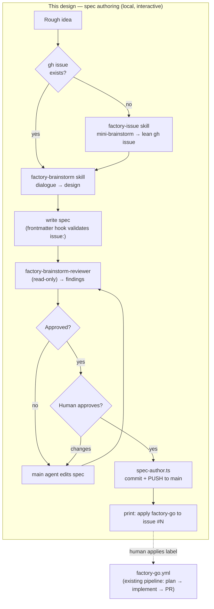
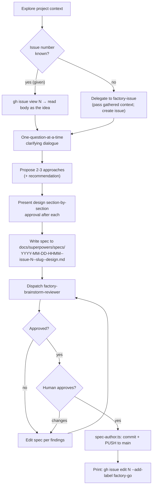

# Factory Brainstorm

## Purpose

Give the AI factory its missing **front-half**. Today the factory _starts_ from a
spec already committed to `main` (with `issue: N` frontmatter); there is no guided
way to author that spec. This design adds an interactive, local-only spec-authoring
flow that mirrors superpowers `brainstorming` but is **fork-and-distilled** into the
factory's own skills — **no runtime dependency on the superpowers plugin** (AI Factory
Design Principle #7).

A developer runs the flow locally, has a one-question-at-a-time dialogue, and the run
ends with an approved, factory-ready spec **committed and pushed to `main`**, plus a
printed hint to apply the `factory-go` label. There is no new GitHub workflow:
brainstorming is inherently interactive and cannot run headless.

This is a training artifact. The bias is toward clarity, local testability, and
visible behavior over production hardening — consistent with the rest of the factory.

## Lifecycle

Where this fits in the existing factory loop (this design covers the **bracketed**
front-half; everything after `factory-go` already exists):

## Design Principles

These extend, and stay consistent with, the AI Factory design principles.

1. **Fork-and-distill, no superpowers runtime dependency.** The new skills are
   distilled from superpowers `brainstorming` but never invoke it. This version-pins
   the workshop's behavior and lets us pin the exact spec output format that the
   downstream `factory-plan` skill consumes.
2. **Deterministic work lives in TypeScript; Claude is only used for judgement.**
   Slug/timestamp/filename generation, reading a gh issue, `gh issue create`, and
   `git add/commit/push` are deterministic — they live in unit-testable `.ts` helpers
   under `scripts/factory/`. The dialogue, design, and spec prose are Claude's job.
3. **Single responsibility per artifact.** Issue creation (`factory-issue` +
   `issue-create.ts`) is separate from spec authoring (`factory-brainstorm` +
   `spec-author.ts`). Each skill is independently invokable.
4. **Independent review, then a human gate.** A read-only subagent reviews the spec
   _document_ (not code). The main agent iterates on its findings until the reviewer
   approves; then the human has the final say before the spec lands on `main`. This
   mirrors the factory's implement-task inner loop, applied to prose.
5. **Local testability is first-class.** `FACTORY_DRY_RUN=1` makes pushes and gh
   writes no-ops while the interactive flow still runs end-to-end.

## Artifacts

Five new artifacts.

| Artifact                                        | Type   | Role                                                      |
| ----------------------------------------------- | ------ | --------------------------------------------------------- |
| `.claude/skills/factory-brainstorm/SKILL.md`    | skill  | Full spec-authoring dialogue → committed spec             |
| `.claude/skills/factory-issue/SKILL.md`         | skill  | Mini-brainstorm → lean gh issue (feature or bug)          |
| `.claude/agents/factory-brainstorm-reviewer.md` | agent  | Read-only spec-doc reviewer (quality + factory-readiness) |
| `scripts/factory/spec-author.ts`                | script | Slug/timestamp/filename, read issue, commit + push        |
| `scripts/factory/issue-create.ts`               | script | Deterministic `gh issue create` (body + labels)           |

`.claude/hooks/factory-spec-frontmatter.ts` (the existing PostToolUse hook that
validates `issue:` on spec writes) is **reused unchanged** — it is the mechanical
guard that the generated spec carries a valid `issue: N`.

## Component: `factory-brainstorm` skill

Distilled from superpowers `brainstorming`. **Keeps:** project-context exploration,
one-question-at-a-time clarifying dialogue, propose-2-3-approaches with a
recommendation, and section-by-section design presentation with approval after each
section. **Drops:** the visual/browser companion (token-intensive; not needed for
spec work).

### Process

### Issue-number resolution (either / detect)

- The skill accepts an **optional** issue number.
- **Given:** it calls `spec-author.ts` to `gh issue view N` and reads the issue body
  as the starting idea, then dialogues from there.
- **Not given:** it delegates to the `factory-issue` skill. If enough context has
  already been gathered in the conversation, `factory-issue` creates the issue
  immediately without re-asking; otherwise `factory-issue` runs its own short
  dialogue. Either way the skill comes back with a real `issue: N`.
- The number is resolved **before** the spec is written, because the
  `factory-spec-frontmatter` hook blocks any spec write that lacks a positive-integer
  `issue:`.

### Spec output (the contract with `factory-plan`)

- Path: `docs/superpowers/specs/YYYY-MM-DD-HHMM--issue-<N>--<slug>--design.md`
  (the factory naming convention; `--` separates logical fields).
- Frontmatter: `name`, `description`, `status: draft`, `issue: <N>`.
- The body is the validated design. Each requirement must be concrete enough that
  `factory-plan` can turn it into bite-sized checkbox tasks.

### Hand-off

After the human approves, `spec-author.ts` commits and **pushes** the spec to `main`,
then the skill prints the exact next step:

> Spec committed and pushed to `main`. To start implementation, apply the label:
> `gh issue edit <N> --add-label factory-go`

Push happens **before** the hint because `factory-go.yml` checks out `main`; the spec
must be on the remote for the pipeline to find it. The human stays in control of the
trigger (no auto-labeling).

## Component: `factory-issue` skill

A lightweight mini-brainstorm whose only goal is a **lean, skimmable** GitHub issue
that captures the core of a request. Independently invokable, and delegated to by
`factory-brainstorm` when no issue exists yet.

### Behavior

1. Ask **feature or bug** first.
2. Ask a _few_ one-at-a-time clarifying questions — just enough to nail the core, not
   a full design dialogue.
3. Compose a short body matched to the type, then call `issue-create.ts`.

Body shapes (kept deliberately short and easy to skim):

- **Feature:** `## What` / `## Why` / `## Constraints / non-goals` (optional) —
  matches the existing `.github/ISSUE_TEMPLATE/factory-idea.md`.
- **Bug:** `## What's broken` / `## Expected` / `## Where` (repro or a pointer).

### Labels

- Feature → `factory-idea`.
- Bug → `factory-idea` + `bug`.

(`issue-create.ts` creates a missing label idempotently so a fresh repo does not fail
the first run.)

### Delegation from `factory-brainstorm`

When `factory-brainstorm` runs with no issue and has already gathered enough context,
it hands that context to `factory-issue`, which creates the issue **without
re-asking**. Used standalone, `factory-issue` asks its own short questions.

## Component: `factory-brainstorm-reviewer` agent

Named by its **phase** to avoid any collision with the existing `factory-spec-reviewer`
(which reviews _code_ against the spec). This agent reviews the **spec document
itself**.

- Read-only tools: `Read, Grep, Glob`.
- `model: opus` (ambiguity-hunting in prose benefits from the strong model).
- Returns a structured verdict: `approved` | `changes-requested`, plus a findings
  list. The main agent (the `factory-brainstorm` skill) iterates on findings and
  re-dispatches until `approved`; the human gate follows.

### Review checklist

1. **Placeholder scan** — no `TBD`/`TODO`/vague requirements.
2. **Internal consistency** — sections do not contradict; architecture matches the
   feature descriptions.
3. **Scope** — focused enough for a single implementation plan, or does it need
   decomposition?
4. **Ambiguity** — any requirement readable two different ways is flagged.
5. **Factory-readiness** —
   - valid `issue: <N>` frontmatter (positive integer);
   - filename matches the factory naming convention;
   - every requirement is concrete enough for `factory-plan` to produce checkbox
     tasks.

## Component: `scripts/factory/spec-author.ts`

Thin, unit-testable helper using `@effect/cli` + `effect` (consistent with the other
factory scripts). Owns the deterministic spec mechanics:

- **Pure functions** (directly unit-tested): `slugify(title)`, `specFilename(date,
issue, slug)`, `buildFrontmatter({name, description, issue})`.
- **Read** an existing issue: `gh issue view <N> --json title,body`.
- **Commit + push** to `main`: `git add <spec>`, `git commit -m "...", `git push`.
- Honors `FACTORY_DRY_RUN=1` — push becomes a no-op; everything else runs.
- The timestamp is taken from the system clock at invocation (passed in / read in the
  I/O shell, not inside pure functions, so tests stay deterministic).

This script **only reads** issues; it never creates them (that is `issue-create.ts`).

## Component: `scripts/factory/issue-create.ts`

Deterministic `gh issue create` wrapper using `@effect/cli` + `effect`:

- **Pure functions** (unit-tested): `featureBody({what, why, constraints})`,
  `bugBody({broken, expected, where})`, `labelsFor(type)`.
- Ensures required labels exist (`gh label create ... || ignore`), then
  `gh issue create --title ... --label ... --body ...`.
- Returns the created issue number / URL.
- Honors `FACTORY_DRY_RUN=1` — prints what it would create instead of calling `gh`.

## Error Handling / Edge Cases

| Case                                          | Behaviour                                                                                                                                                  |
| --------------------------------------------- | ---------------------------------------------------------------------------------------------------------------------------------------------------------- |
| No issue number, human declines to create one | The spec write would be blocked by the frontmatter hook, so the skill resolves the number first — it will not proceed to write without a valid `issue: N`. |
| `factory-brainstorm-reviewer` never approves  | Bounded by the interactive dialogue; the human may override and proceed to their own gate.                                                                 |
| `git push` fails (auth)                       | `spec-author.ts` surfaces the error; the spec stays committed locally so no work is lost. The user can retry the push.                                     |
| Label missing in a fresh repo                 | `issue-create.ts` creates the label idempotently before `gh issue create`.                                                                                 |
| `FACTORY_DRY_RUN=1`                           | No push, no gh writes; the full interactive flow still runs.                                                                                               |

## Testing

- `scripts/factory/spec-author.test.ts` (`bun test`): `slugify`, `specFilename`,
  `buildFrontmatter`. gh/git paths exercised behind dry-run.
- `scripts/factory/issue-create.test.ts` (`bun test`): `featureBody`, `bugBody`,
  `labelsFor`. gh path behind dry-run.
- Skills and the agent are markdown; verified by (a) the existing
  `factory-spec-frontmatter` hook accepting a generated spec and (b) a manual local
  dry-run of the full flow.
- Per repo `CLAUDE.md`: run `npm run lint` and `npm run test` (or the `bun`
  equivalents the factory scripts use) after implementation.

## Out of Scope

- A GitHub workflow for brainstorming (it is interactive; it stays local).
- Auto-applying the `factory-go` label (the human owns the trigger).
- The visual/browser companion from superpowers brainstorming.
- Multi-spec / decomposition automation (the reviewer _flags_ when decomposition is
  needed; splitting is a manual follow-up).

## Future / Parked

- **Debugging support.** A distilled `factory-debug` (from superpowers
  `systematic-debugging`) is a likely future cycle. Open design question for then:
  _where_ it plugs in — the implement-task loop when a task's tests will not go green,
  a `/factory-debug` PR comment sibling to `/factory-revise`, or both. Tracked as a
  separate brainstorm.
