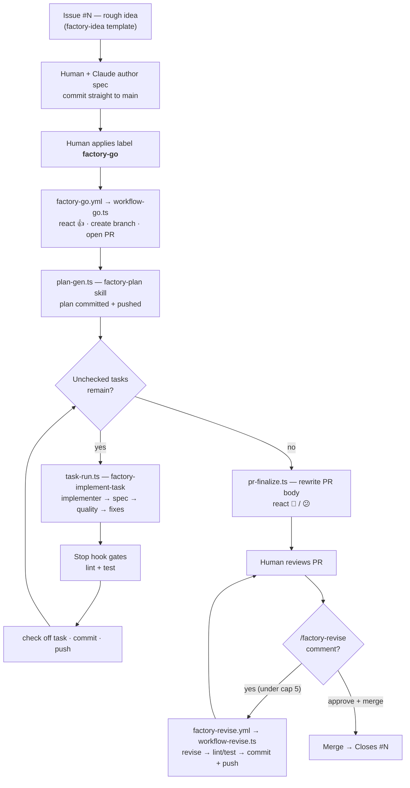
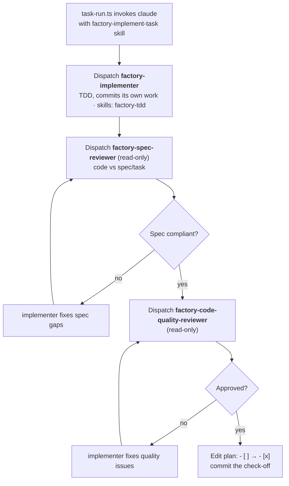

# AI Factory

## Purpose

Give the workshop a demonstrable, end-to-end "AI factory" workflow: a labeled
GitHub issue triggers Claude to autonomously plan and implement a change, the
work appears live in a PR, humans review, and reviewers iterate by leaving a
slash-command comment until they approve and merge.

The existing Claude Code plan mode used in the workshop is **not** changed by
this design; the factory is additive.

This is a training artifact. The bias is toward clarity, local testability,
and visible behavior over production hardening.

## Lifecycle

At a glance:



Detailed steps:

```
gh issue #N (rough idea — human writes via factory-idea issue template)
        │
        ▼  human + Claude collaboratively author the spec locally;
           commit straight to main (no spec PR)
docs/superpowers/specs/YYYY-MM-DD-HHMM--issue-N--<slug>--design.md
   frontmatter:  issue: N
        │
        ▼  human applies label `factory-go` to issue #N
        │
        ▼  factory-go.yml fires (on: issues.labeled, filter: factory-go)
              workflow runs: bun scripts/factory/workflow-go.ts which performs:
                  ◦ react 👍 on the issue (gh api reactions)
                  ◦ create branch factory/issue-N--<slug>, empty seed commit, push
                  ◦ gh pr create --base main --head <branch>
                    --title "feat: <issue title>"
                    --body "Closes #N\n\nspec: <spec path>"
                  ◦ invoke Claude via plan-gen.ts with the factory-plan skill
                    → plan file committed + pushed (appears in PR)
                  ◦ task-run.ts loop: while the plan has unchecked tasks:
                      - invoke Claude on one task using the factory-implement-task
                        skill (factory-implementer → factory-spec-reviewer →
                        factory-code-quality-reviewer → fixes)
                      - Stop hook gates lint+test green
                      - check off the task in the plan
                      - commit the check-off
                      - git push
                  ◦ invoke Claude via pr-finalize.ts to rewrite the PR
                    description (synthesises plan + commit log)
                  ◦ react 🎉 on the issue if all green, 😕 if not
        │
        ▼  human reviews the PR
        │
        ▼  human comments `/factory-revise <message>` anywhere on PR
              factory-revise.yml fires
                  concurrency: factory-revise-pr-<N>, cancel-in-progress: true
                  workflow runs: bun scripts/factory/workflow-revise.ts which performs:
                      ◦ react 👍 on the triggering comment (gh api reactions)
                      ◦ increment .factory/revise-count-<pr>.txt
                      ◦ if count > 5: post comment "cap reached", exit 1
                      ◦ gather: all unresolved review comments + the triggering
                        comment context
                      ◦ invoke Claude with the revise prompt
                      ◦ Stop hook gates lint+test green
                      ◦ commit + push
                      ◦ react 🎉 / 😕 on the triggering comment
        │
        ▼  human approves + merges → `Closes #N` closes the issue
```

## Design Principles

1. **Deterministic actions are workflow steps or TypeScript scripts; Claude is
   only used where judgement is needed.** Branch creation, PR opening, label
   reactions, gh API calls, lint/test gating — never Claude.
2. **TypeScript over inline bash.** Workflow YAML steps are one-liners that
   invoke `bun scripts/factory/<entry>.ts`. Logic lives in `.ts` files so it is
   unit-testable with `bun test` and runnable locally end-to-end.
3. **One Claude invocation per logical step.** Plan generation, each task
   implementation, the PR-description finalisation, and each revise round are
   all separate CLI invocations of `claude`. This gives clean log boundaries,
   per-step retry semantics, and predictable timeouts.
4. **Per-task progress is tracked in the plan file itself**, by checking off
   `- [ ]` to `- [x]`. The plan file is the cross-session source of truth.
5. **No subagent orchestration _across_ tasks.** Inter-task iteration is a
   `task-run.ts` loop in TypeScript. _Within_ a single task, the project-local
   `factory-implement-task` skill orchestrates three custom subagents
   (implementer, spec-reviewer, code-quality-reviewer) for spec-compliance and
   code-quality review.
6. **Local testability is first-class.** Every script can be run on a developer
   machine with environment variables and `--dry-run` flags. The Claude CLI's
   stream-json output is tee'd to both `stdout` and a log file so the operator
   can `tail -f .factory/logs/` while a run is in progress.
7. **Self-contained factory skills and agents — no runtime dependency on
   superpowers.** The factory ships its own skills (`.claude/skills/factory-*`)
   and subagent definitions (`.claude/agents/factory-*`). They are distilled
   from superpowers primitives (`writing-plans`, `subagent-driven-development`,
   `test-driven-development`) but deliberately omit the parts that conflict with
   the factory model — worktrees, branch-finishing, and cross-task looping. This
   gives direct, version-pinned control and makes the constraints (single task,
   current branch, no worktree, no PR) **native to the agent definitions**
   rather than bolted on via prompt injection.

## Naming Conventions

- Filename separator: `--` between fields. Both the timestamp and each logical
  field are dash-separated; the `--` distinguishes field boundaries from
  in-field dashes.
- Spec files: `docs/superpowers/specs/YYYY-MM-DD-HHMM--issue-<N>--<slug>--design.md`
- Plan files: `docs/superpowers/plans/YYYY-MM-DD-HHMM--issue-<N>--<slug>--plan.md`
  Spec and plan for the same issue share the `issue-<N>--<slug>` core (each
  has its own timestamp).
- Branch name: `factory/issue-<N>--<slug>`.
- Trigger label: `factory-go`.
- Trigger comment: `/factory-revise` (anywhere in the comment body, on a PR).
- Workflow files: `factory-go.yml`, `factory-revise.yml` — the filename matches
  the trigger word verbatim so the relation is obvious at a glance.

## Repo Layout

New paths added by this design:

```
.github/
├── workflows/
│   ├── factory-go.yml
│   └── factory-revise.yml
├── ISSUE_TEMPLATE/
│   └── factory-idea.md
└── pull_request_template.md

.claude/
├── settings.json                       # extended with Stop hook + PostToolUse hook
├── skills/
│   ├── factory-plan/SKILL.md           # plan generation (distilled writing-plans)
│   ├── factory-implement-task/SKILL.md # single-task orchestrator (implementer + 2 reviewers)
│   └── factory-tdd/SKILL.md            # TDD discipline the implementer follows
├── agents/
│   ├── factory-implementer.md          # implements ONE task via TDD; no branch/worktree/PR
│   ├── factory-spec-reviewer.md        # read-only: code vs spec
│   └── factory-code-quality-reviewer.md # read-only: code quality
└── hooks/
    ├── factory-spec-frontmatter.ts     # PostToolUse: validates spec frontmatter
    └── factory-test-gate.ts            # Stop hook: lint+test gating

.factory/                               # gitignored runtime state
├── revise-count-<pr>.txt
├── test-gate-attempts-<session-id>.txt
└── logs/
    └── <workflow-run-id>--<step>.jsonl

scripts/factory/
├── workflow-go.ts                      # entry point for factory-go.yml
├── workflow-revise.ts                  # entry point for factory-revise.yml
├── plan-gen.ts                         # Claude invocation: factory-plan skill
├── task-run.ts                         # Claude invocation: one task (factory-implement-task)
├── pr-finalize.ts                      # Claude invocation: rewrite PR description
├── claude.ts                           # shared CLI wrapper (stream-json + logging)
├── plan.ts                             # plan markdown parsing helpers
├── github.ts                           # gh CLI helpers
└── *.test.ts                           # unit tests with bun test

docs/superpowers/
├── specs/
└── plans/
```

`scripts/lint-fix.sh` and the existing PostToolUse hook stay untouched.

## Implementation Notes

### TypeScript / Effect

All scripts under `scripts/factory/` use `@effect/cli` for argument parsing
and `effect` for orchestration. This makes each command testable as an Effect
value, removes hand-rolled error plumbing, and gives consistent `--help` and
`--version` output.

DevDependencies to add: `@effect/cli`, `effect`, `@effect/platform`,
`@effect/platform-bun`.

The `.claude/hooks/*.ts` files are small enough that they stay as plain
TypeScript with a `#!/usr/bin/env bun` shebang; introducing Effect there would
be overhead without benefit.

### Claude CLI invocations

`claude.ts` is the only place that spawns the Claude CLI. It:

- Runs `claude --print --output-format=stream-json --verbose ...` with the
  provided prompt.
- Pipes stdout into two sinks:
  - the parent process's stdout (so workflow logs and local terminals show
    progress, with a prettifier when `process.stdout.isTTY` is true);
  - `.factory/logs/<run-id>--<step>.jsonl` (raw stream-json for forensics).
- **Auth is environment-adaptive — no API key is required locally.** If
  `ANTHROPIC_API_KEY` is present in the environment (the CI path), it is
  forwarded to the CLI. If it is absent (the local-developer path), `claude` is
  invoked with no key and falls back to the operator's logged-in **subscription**
  session (the CLI's stored OAuth credentials). `claude.ts` therefore never
  _requires_ the key; it only forwards one when set. This lets the exact same
  script run unchanged in CI (API key) and on a developer machine (subscription).
- Scopes `--allowedTools` **per step** so the factory-mode constraints are
  enforced at the tool layer, not just by prompt wording. Plan/finalise steps
  get no branch/push/`gh pr` access; task steps get `Agent` (the dispatch tool —
  renamed from `Task` in current SDKs) plus `git add`/`git commit`, but never
  branch creation, `git worktree`, or `gh pr`. The deeper constraints live in
  the factory skills and agent definitions (see "Factory skills and agents"), so
  no ad-hoc system-prompt injection is needed.
- In CI, passes a non-interactive **permission mode** (e.g.
  `--permission-mode acceptEdits`) so the headless run never blocks on a
  permission prompt no human can answer. The scoped `--allowedTools` plus each
  agent's own `tools:` allowlist remain the real safety boundary.
- Accepts `--model`, `--max-turns`, and `--allowedTools` arguments.
- Returns an `Effect` that succeeds with the final assistant message text and
  fails with a typed error on non-zero exit.

### Per-task prompt

`task-run.ts` builds a per-task prompt of roughly this shape (verbatim wording
is for the implementation plan to finalise):

> You are implementing exactly ONE task from a plan already committed to this
> branch. Do **not** loop over other tasks.
>
> Spec: `<spec path>`
> Plan: `<plan path>`
> Task to implement:
>
> ```
> <task heading + body extracted from plan>
> ```
>
> Use the `factory-implement-task` skill for this single task. It dispatches the
> `factory-implementer`, `factory-spec-reviewer`, and `factory-code-quality-reviewer`
> agents and iterates review feedback until both reviewers approve. Those agents
> already enforce factory mode (single task, current branch, no worktree, no
> branch creation, no PR) through their own system prompts and tool allowlists,
> so you do not need to restate those rules.
>
> The `Stop` hook will gate `bun run lint && bun test`; do not bypass it.
>
> When the implementation is approved by reviewers and tests are green, edit
> the plan file to change `- [ ]` to `- [x]` for this task and commit that
> change with message `factory: complete task <N> — <task title>`.

After the CLI exits, `task-run.ts` verifies the task is now checked off and
new commits exist on the branch. If either check fails, the loop halts and a
PR comment is posted explaining the failure.

### Factory skills and agents

The factory ships a small, self-contained set of skills and subagent
definitions under `.claude/`. They are **distilled from** superpowers
primitives but have **no runtime dependency** on the superpowers plugin — the
factory never invokes `writing-plans`, `subagent-driven-development`,
`test-driven-development`, `using-git-worktrees`,
`finishing-a-development-branch`, or `executing-plans` directly.

**Why fork rather than constrain.** `subagent-driven-development` is a
_whole-plan_ orchestrator: it loops over every task without stopping and
terminates in `finishing-a-development-branch`, and it lists `using-git-worktrees`
as a required workflow skill. The factory needs only its _per-task inner loop_.
Vendoring that loop (plus the plan and TDD discipline) is more direct than
invoking those skills and negating their built-in behaviour, and it
version-pins the demo so a future superpowers release cannot silently change
how the workshop behaves.

**Mapping (what each artifact is distilled from):**

| Factory artifact                               | Distilled from                                | Purpose                                                                    |
| ---------------------------------------------- | --------------------------------------------- | -------------------------------------------------------------------------- |
| `.claude/skills/factory-plan`                  | `writing-plans`                               | `plan-gen.ts`: turn the spec into a checkbox task plan with `issue-<N>` fm |
| `.claude/skills/factory-implement-task`        | `subagent-driven-development` (per-task only) | `task-run.ts`: orchestrate one task — implement → spec review → quality    |
| `.claude/skills/factory-tdd`                   | `test-driven-development`                     | the discipline the implementer agent follows                               |
| `.claude/agents/factory-implementer`           | `implementer-prompt.md`                       | implement one task via TDD, commit its own work                            |
| `.claude/agents/factory-spec-reviewer`         | `spec-reviewer-prompt.md`                     | confirm code matches the spec/task                                         |
| `.claude/agents/factory-code-quality-reviewer` | `code-quality-reviewer-prompt.md`             | review code quality                                                        |

The per-task inner loop the `factory-implement-task` skill drives:



**Enforcement lives in the agent definitions.** Each custom agent carries its
own system prompt and tool allowlist, so "single task, current branch, no
worktree, no PR" is _native_ — a subagent literally lacks the tools to push or
open a PR, and there is no `--append-system-prompt` propagation to get wrong. A
subagent's `tools:` allowlist is **authoritative for that subagent**: the
top-level CLI `--allowedTools` governs only the orchestrator and cannot widen a
subagent's grants (confirmed against current Claude Code docs — see "Validation
spike"). Example:

```text
// .claude/agents/factory-implementer.md
---
name: factory-implementer
description: Implements exactly one plan task via TDD on the current branch.
tools: Read, Edit, Write, Grep, Glob, Bash(bun:*), Bash(git add:*), Bash(git commit:*)
skills: factory-tdd
model: sonnet
---
You implement exactly ONE task via TDD, in the current working directory on the
already-checked-out branch. The factory-tdd skill is preloaded — follow it.
Commit your own work with a clear message. You NEVER create a branch or git
worktree, never push, and never create or merge a pull request — you do not have
the tools to do so, and the surrounding pipeline owns those steps.
```

The two reviewer agents are granted only read/inspection tools (`Read`, `Grep`,
`Glob`, `Bash(git diff:*)`, `Bash(git log:*)`, `Bash(bun test:*)`) — they cannot
modify files, so review and implementation stay cleanly separated.

The orchestrator (the `claude` process `task-run.ts` spawns) takes its
constraints from the `factory-implement-task` skill it is pointed at, and
`claude.ts` additionally scopes `--allowedTools` per step (see "Claude CLI
invocations"). `pr-finalize.ts` and `workflow-revise.ts` prompts state
explicitly that they only edit the PR body / commit fixes and never finalise or
merge the branch.

**Diagrams in `SKILL.md` files (mirror superpowers, rendered as mermaid).** Each
factory skill reproduces its source skill's diagram convention exactly — same
sections, same diagrams — but authored in a ` ```mermaid ` block instead of a
Graphviz ` ```dot ` digraph. No skill gains a diagram its source lacks, and none
drops one its source has:

- `factory-implement-task` (from `subagent-driven-development`) → a **When to
  Use** decision diagram and a **The Process** flow diagram (the per-task inner
  loop shown above).
- `factory-tdd` (from `test-driven-development`) → the **red-green-refactor**
  cycle diagram in its core section.
- `factory-plan` (from `writing-plans`) → **no diagram** — the source skill has
  none, so neither does this one.

### Stop hook semantics (`factory-test-gate.ts`)

Reads the JSON event on stdin. Behaviour:

- If `stop_hook_active === true`, exit 0 (avoid infinite loops).
- Read attempt count from `.factory/test-gate-attempts-<session-id>.txt`,
  default 0. Increment and write back.
- Run `bun run lint` and `bun test`.
- If both pass: remove the counter file and exit 0.
- If attempts ≥ 3: remove the counter file and exit 0 (give up so the session
  can end; `task-run.ts` will detect the red tests and halt the outer loop).
- Otherwise: print the last ~4KB of combined lint+test stderr to stderr and
  exit **2** (Claude Code convention: block stop and feed stderr to the model).

### PostToolUse hook (`factory-spec-frontmatter.ts`)

Reads the JSON event on stdin. If the edited file matches
`docs/superpowers/specs/**.md`, parse YAML frontmatter and verify `issue:` is
a positive integer. On failure, exit 2 with a clear error message so Claude
sees and fixes it.

### Live observability

- **In CI:** `claude.ts` writes structured progress lines to
  `$GITHUB_STEP_SUMMARY` (one line per task completion, plus the lint/test
  outcome). After the workflow finishes, `.factory/logs/*` are uploaded as an
  artifact via `actions/upload-artifact@v4` so reviewers can download a full
  transcript.
- **Locally:** when `process.stdout.isTTY` is true, `claude.ts` writes
  prettified lines to the terminal in real time and also keeps the raw JSONL
  on disk. The operator can `tail -f .factory/logs/*.jsonl` for the raw feed
  during a run.

### Reactions

Both workflows use `gh api` to:

- Post a `+1` reaction immediately on workflow start (factory-go reacts to the
  issue, factory-revise reacts to the triggering comment).
- Post a `hooray` reaction on full success, or `confused` on failure.

This provides instant visual feedback in GitHub that the trigger was picked
up — important for the workshop demo since participants will be looking for
proof that "something is happening."

### Caps and timeouts

- Workflow timeout: `factory-go` 60 min, `factory-revise` 30 min.
- Claude CLI `--max-turns`: 50 for plan-gen, 50 per task, 30 for revise, 20
  for pr-finalize.
- Revise iteration cap: 5 per PR (tracked in `.factory/revise-count-<pr>.txt`,
  enforced by `workflow-revise.ts`).
- Stop hook test-gate: 3 attempts per Claude session.

### Secrets and gitignore

- **CI:** `ANTHROPIC_API_KEY` lives in repo secrets. Workshop guidance: use a
  workshop-scoped key with a configured spend cap on the Anthropic console.
- **Local:** no API key is needed — `claude.ts` falls back to the operator's
  logged-in subscription session when `ANTHROPIC_API_KEY` is unset (see "Claude
  CLI invocations").
- `.gitignore` adds `.factory/`.

## Workflow YAML Sketches

```yaml
# .github/workflows/factory-go.yml
name: factory-go
on:
  issues:
    types: [labeled]

concurrency:
  group: factory-go-issue-${{ github.event.issue.number }}
  cancel-in-progress: false

jobs:
  build:
    if: github.event.label.name == 'factory-go'
    runs-on: ubuntu-latest
    timeout-minutes: 60
    permissions:
      contents: write
      issues: write
      pull-requests: write
    env:
      ANTHROPIC_API_KEY: ${{ secrets.ANTHROPIC_API_KEY }}
      GH_TOKEN: ${{ secrets.GITHUB_TOKEN }}
      ISSUE_NUMBER: ${{ github.event.issue.number }}
    steps:
      - uses: actions/checkout@v4
        with: { fetch-depth: 0 }
      - uses: oven-sh/setup-bun@v2
      - run: bun install --frozen-lockfile
      - run: bun add -g @anthropic-ai/claude-code
      - run: bun scripts/factory/workflow-go.ts
      - if: always()
        uses: actions/upload-artifact@v4
        with:
          name: factory-logs-${{ github.run_id }}
          path: .factory/logs/
```

```yaml
# .github/workflows/factory-revise.yml
name: factory-revise
on:
  issue_comment:
    types: [created]

concurrency:
  group: factory-revise-pr-${{ github.event.issue.number }}
  cancel-in-progress: true

jobs:
  revise:
    if: |
      github.event.issue.pull_request != null &&
      contains(github.event.comment.body, '/factory-revise')
    runs-on: ubuntu-latest
    timeout-minutes: 30
    permissions:
      contents: write
      issues: write
      pull-requests: write
    env:
      ANTHROPIC_API_KEY: ${{ secrets.ANTHROPIC_API_KEY }}
      GH_TOKEN: ${{ secrets.GITHUB_TOKEN }}
      PR_NUMBER: ${{ github.event.issue.number }}
      COMMENT_ID: ${{ github.event.comment.id }}
    steps:
      - uses: actions/checkout@v4
        with: { ref: refs/pull/${{ github.event.issue.number }}/head }
      - uses: oven-sh/setup-bun@v2
      - run: bun install --frozen-lockfile
      - run: bun add -g @anthropic-ai/claude-code
      - run: bun scripts/factory/workflow-revise.ts
      - if: always()
        uses: actions/upload-artifact@v4
        with:
          name: factory-logs-${{ github.run_id }}
          path: .factory/logs/
```

## Templates

`.github/ISSUE_TEMPLATE/factory-idea.md`:

```markdown
---
name: Factory idea
about: A rough idea. A human turns it into a spec, then labels `factory-go` to kick off the AI factory.
title: "[idea] "
labels: ["factory-idea"]
---

## What

<one paragraph>

## Why

<one paragraph>

## Constraints / non-goals

<bullets, optional>
```

`.github/pull_request_template.md` (used by humans; the factory overwrites
the body via `pr-finalize.ts`):

```markdown
## Summary

<what changed and why>

## Test plan

- [ ] ...
```

## Local Development

Every Claude-invocation script supports being run standalone:

```bash
# whole flow against a real issue, no push / no PR
ISSUE_NUMBER=42 bun scripts/factory/workflow-go.ts --dry-run

# only the plan-gen step
ISSUE_NUMBER=42 bun scripts/factory/plan-gen.ts

# one task from an existing plan
bun scripts/factory/task-run.ts \
  --plan docs/superpowers/plans/2026-06-01-1200--issue-42--export-csv--plan.md \
  --task-index 0

# simulate a revise round locally
PR_NUMBER=99 bun scripts/factory/workflow-revise.ts --dry-run
```

`FACTORY_DRY_RUN=1` is honoured globally — pushes, PR-comment posts, and
reactions become no-ops, but Claude is still invoked.

## Edge Cases

| Case                                            | Behaviour                                                                                                                  |
| ----------------------------------------------- | -------------------------------------------------------------------------------------------------------------------------- |
| `factory-go` applied with no matching spec      | `workflow-go.ts` exits 1, posts a PR-less comment on the issue: "no spec found with frontmatter `issue: <N>`."             |
| Label removed and re-added during a run         | Concurrency group `factory-go-issue-<N>` with `cancel-in-progress: false` queues a second run; the first finishes first.   |
| Plan markdown malformed                         | `plan.ts` parser throws a typed error; `workflow-go.ts` halts and posts the parser error in a PR comment.                  |
| Subagent loop never approves                    | CLI's `--max-turns` enforces hard ceiling; `task-run.ts` sees no task check-off, halts the outer loop, posts a PR comment. |
| `/factory-revise` posted on an issue (not a PR) | Workflow `if:` filter excludes it; no run, no reaction.                                                                    |
| Revise cap exceeded                             | `workflow-revise.ts` posts "iteration cap of 5 reached for this PR" comment, exits 1.                                      |

## Out of Scope

- Production-grade auth (no GitHub App; PAT/`GITHUB_TOKEN` is sufficient for a
  workshop repo).
- Multi-repo / monorepo support.
- Resuming an interrupted run mid-task (next run starts fresh from the first
  unchecked task; the plan file's checkboxes make this safe).
- Auto-deployment after merge.
- Spec validation as a GitHub workflow (the PostToolUse hook covers the
  author-time case, which is enough for the workshop).

## Validation Spike

The headless-execution assumptions were validated against current Claude Code
docs and an empirical `claude --print` test. Confirmed:

- **Project agents are discoverable and dispatchable by name in `--print`
  mode.** Agents in `.claude/agents/*.md` are loaded at session start (they
  appear in the session-init event) and can be dispatched by `subagent_type`.
  The dispatch tool is now named `Agent` (older SDKs emitted `Task`).
- **A subagent's `tools:` allowlist is authoritative for that subagent.** The
  CLI `--allowedTools` governs only the top-level orchestrator and cannot widen
  a subagent's grants — so read-only reviewer agents genuinely cannot edit or
  push. `tools:` is an allowlist; `disallowedTools:` (applied first) is also
  supported.
- **Skills work headless, and agents can preload them.** Project
  `.claude/skills/*/SKILL.md` are invocable in `--print` mode. An agent can
  preload a skill via the `skills:` frontmatter field (used for
  `factory-implementer` → `factory-tdd`), or invoke skills at runtime if `Skill`
  is in its `tools:`.
- **Useful agent frontmatter fields confirmed:** `name`, `description`, `tools`,
  `disallowedTools`, `model` (`sonnet`/`opus`/`haiku`/`inherit`/full-id),
  `skills`, `maxTurns`, `permissionMode`.

## Open Questions

The implementation plan should still confirm, against the installed versions:

- The exact `@effect/cli` API surface (`Command.make` / `Options.*` /
  `Command.run`).
- The exact Bash-scoping pattern grammar for `tools:` / `--allowedTools` — docs
  show both colon (`Bash(git commit:*)`) and space (`Bash(git commit *)`) forms;
  pin down the one the installed CLI honours with a quick local check before
  relying on it for the no-push/no-`gh` boundary.
- The exact non-interactive permission flag for the CI invocation
  (`--permission-mode` value vs. relying solely on `--allowedTools`).
